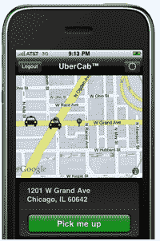

# UberCab 被勒令停止

> 原文：<https://web.archive.org/web/https://techcrunch.com/2010/10/24/ubercab-ordered-to-cease-and-desist/>

[Uber cab](https://web.archive.org/web/20230330200530/https://techcrunch.com/2010/07/05/ubercab-takes-the-hassle-out-of-booking-a-car-service/)是不是刚刚撞车烧毁？加州出租车和豪华轿车业内人士今天告诉 TechCrunch，旧金山地铁运输管理局&加州公共事业委员会已经下令这家初创公司停止运营。

更新:自 10 月 20 日订单到达以来，Ubercab 一直在受到处罚的威胁，包括每次 Ubercab 运营高达 5000 美元的费用，以及公司在订单到期后继续运营的每一天可能需要 90 天的监禁。

该公司的品牌名称和标志似乎在蜕变；在其网站和博客上，Ubercab 的标志现在简单地写着“优步”，该公司昨天下午在自己的[脸书社区](https://web.archive.org/web/20230330200530/http://www.facebook.com/#!/pages/UberCab/120945717945722?v=wall)评论道，“更像 Uber 而不是 cab。”

Ubercab 首席执行官瑞安·格雷夫斯(Ryan Graves)告诉 TechCrunch，“我们正在与(相关)机构合作，找出他们确切的担忧，并确保我们合规。”除此之外，他没有发表任何评论，但他提到了该公司今天(10 月 24 日)在其博客上发布的官方公开声明:

> 旧金山地铁运输管理局和加州公共事业委员会已经向 UberCab Inc .发出了停止令。虽然我们正在调查提出的问题，但我们相信我们提供的服务符合引用的法规。
> 
> UberCab 是第一个上市的尖端交通技术，必须认识到，城市和州监管机构的法规并没有考虑到这些创新。因此，我们很乐意帮助监管机构了解这种新一代技术，并与这两家机构密切合作，以确保合规性，并为我们真正的优步用户及其司机提供我们的服务。
> 
> 我们的承诺是促进改善运输选择，提供安全、可靠和方便的旅行。这一点不会改变。我们将继续全速前进，完成使旧金山成为一个生活和旅行的好地方的使命。

Ubercab 的移动应用程序让用户请求一项汽车服务，无论他们现在在哪里都可以接他们，并让用户用手机支付汽车服务费用。这家初创公司从司机赚的钱中抽取一部分来创造收入。本月早些时候，Ubercab 完成了由第一轮[领投的 125 万美元天使投资](https://web.archive.org/web/20230330200530/https://techcrunch.com/2010/10/15/ubercab-closes-uber-angel-round/)。

尽管旧金山出租车行业自 9 月以来一直在抱怨 Ubercab 的业务是否合法，但这笔资金还是到来了。据[报道，一名忧心忡忡的司机在出租车顾问委员会会议上提出了此事，这位幽灵出租车司机 Phites 回博客](https://web.archive.org/web/20230330200530/http://phantomcabdriverphites.blogspot.com/2010/09/tac-iii-part-2.html)。

该公司的投资者和创始人之一[特拉维斯·卡兰尼克](https://web.archive.org/web/20230330200530/http://www.crunchbase.com/person/travis-kalanick)周日表示，“我们以前见过这种情况。新技术的出现，起初似乎对现有产业构成了威胁。最终，这些行业会看到该技术的好处，并最终找到以富有成效的方式使用它的方法，并接受创新。”卡兰尼克还创立了早期的 p2p(点对点)搜索引擎 Scour，该引擎在 90 年代遭到了好莱坞高管的抵制，他们不希望自己的内容在网上发布。

现有出租车行业对 Ubercab 的担忧包括以下几点:

相比之下，优步——nee Uber cab——通常不把自己定位为出租车服务，而是一款帮助搭车者通过手机快速方便地预订高级汽车和司机，并帮助有执照的豪华轿车司机与客户联系的应用。

**更多** : [UberCab 停止&停止意味着一件事:他们正在做某事](https://web.archive.org/web/20230330200530/https://techcrunch.com/2010/10/24/ubercab/ "UberCab Cease & Desist Means One Thing: They’re Onto Something")