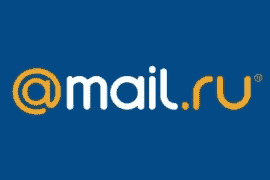

# 脸书、Groupon 和 Zynga 投资者 Mail.ru(又名 DST)在 IPO 中的估值达到 57 亿美元

> 原文：<https://web.archive.org/web/https://techcrunch.com/2010/10/25/dst-mail-ru-ipo/>

# 脸书、Groupon 和 Zynga 的投资者 Mail.ru(又名 DST)力争在 IPO 中获得 57 亿美元的估值

[Mail.ru Group](https://web.archive.org/web/20230404160024/http://mail.ru/) ，原名 [Digital Sky Technologies](https://web.archive.org/web/20230404160024/http://www.crunchbase.com/company/digital-sky-technologies) ，是互联网轰动事件[脸书](https://web.archive.org/web/20230404160024/http://www.crunchbase.com/company/facebook)、 [Groupon](https://web.archive.org/web/20230404160024/http://www.crunchbase.com/company/groupon) 和 [Zynga](https://web.archive.org/web/20230404160024/http://www.crunchbase.com/company/zynga) 等公司的著名投资者，[已经申请](https://web.archive.org/web/20230404160024/http://www.investegate.co.uk/Article.aspx?id=201010250700079230U)在伦敦证券交易所进行[8.76 亿美元的首次公开募股](https://web.archive.org/web/20230404160024/http://www.bloomberg.com/news/2010-10-25/russian-facebook-investor-mail-ru-seeks-876-million-in-ipo.html?dbk)，该投资公司的估值将高达[57 亿美元](https://web.archive.org/web/20230404160024/http://online.wsj.com/article/SB10001424052702304388304575573672980441324.html)

这一估值高于预期(之前的报道预测估值为 50 亿美元)。

Mail.ru 主要包括俄罗斯的电子邮件、社交网络和游戏网站，它在监管披露中表示，将以每股 23.70 美元至 27.70 美元的价格，以全球存托凭证的形式发行 300 多万股新股和 2859 万股现有股票。

股票将获准在伦敦证券交易所标准上市，股票代码为“MAIL”。

需要澄清的是，Mail.ru Group 是 DST 俄罗斯控股公司的新名称——其国际投资由 [DST Global](https://web.archive.org/web/20230404160024/http://dst-global.com/) 负责，DST Global 保留了其名称，不会上市。

据俄罗斯商业报纸 [Vedomosti](https://web.archive.org/web/20230404160024/http://www.vedomosti.ru/companies/news/1130999/mailru_group_ocenila_vkontakte_v_15_mlrd) 报道，Mail.ru 集团首次公开募股的部分收益高达 8.76 亿美元(供你参考，略高于脸书自成立以来筹集的资本总额)，将用于增加该公司在俄罗斯最大的社交网络【vKontakte.ru】的股份。

已经拥有社交网络 [Odnoklassniki.ru](https://web.archive.org/web/20230404160024/http://www.crunchbase.com/company/odnoklassniki) 和 [ICQ](https://web.archive.org/web/20230404160024/http://www.crunchbase.com/company/icq-2) 的 Mail.ru Group 计划以 1.125 亿美元购买 vKontakte 7.5%的股份，将其股权从 24.99%增加到 32.49%。这项投资对该网站的估价为 15 亿美元。

Mail.ru 还购买了在未来一年内收购 vKontakte 额外 7.5%股份的期权，如果行使该期权，其股份将达到 39.99%。

Mail.ru 集团股东包括俄罗斯亿万富翁[阿利舍尔·乌斯马诺夫](https://web.archive.org/web/20230404160024/http://en.wikipedia.org/wiki/Alisher_Usmanov)，南非媒体公司 [Naspers](https://web.archive.org/web/20230404160024/http://www.crunchbase.com/company/naspers) ，中国[腾讯](https://web.archive.org/web/20230404160024/http://www.crunchbase.com/company/tencent)，高盛，老虎全球管理公司和 DST 创始人[尤里·米尔纳](https://web.archive.org/web/20230404160024/http://www.crunchbase.com/person/yuri-milner)。

高盛(Goldman Sachs)和摩根大通(J.P. Morgan Chase)是此次 IPO 的联席协调人，两家银行正与摩根士丹利(Morgan Stanley)和 VTB 资本(Bernstein Capital)合作，担任此次发行的联席账簿管理人。