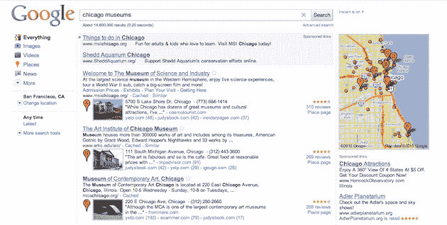
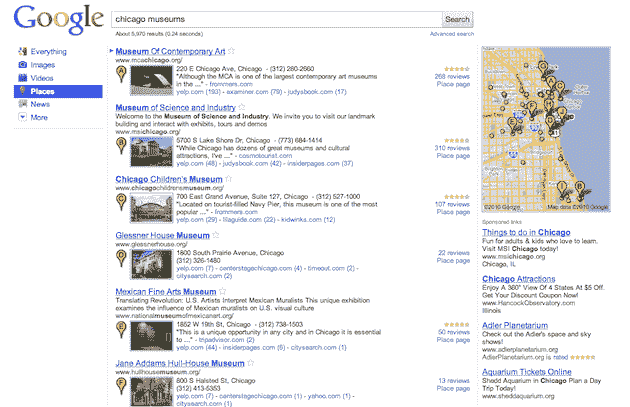

# 随着谷歌推出位置搜索，这是一场位置争夺战

> 原文：<https://web.archive.org/web/https://techcrunch.com/2010/10/27/google-place-search/>

# 随着谷歌推出位置搜索，这是一场位置争夺战

早在 4 月份，我们[就注意到](https://web.archive.org/web/20221208221542/https://beta.techcrunch.com/2010/04/20/google-places/)谷歌即将升级所谓的“位置战”,将他们的 Locale 商务中心改造并更名为 Google Places。自那以后，他们做了很多工作来改善这个领域(尽管与 Yelp 就结果进行了[分分合合](https://web.archive.org/web/20221208221542/https://beta.techcrunch.com/2010/07/26/google-yelp/) / [分分合合](https://web.archive.org/web/20221208221542/https://beta.techcrunch.com/2010/10/15/google-places-updates-reviews-section-yelp-is-back/)的战争)，他们显然对此感觉良好。我哪里知道？因为从今天开始，他们将会在谷歌搜索中大量增加位置搜索结果。

现在，当你进行谷歌认为是试图发现一个位置的搜索时，地点搜索将驻留在 Google.com 上。它在左边的工具栏(你知道，那里有“图片”、“视频”、“购物”等)也有一个主页作为“位置”，用户可以点击它来获得位置结果。

在他们的博客文章中，谷歌[提到](https://web.archive.org/web/20221208221542/http://googleblog.blogspot.com/2010/10/place-search-faster-easier-way-to-find.html):

> 我们的方法有一个很棒的地方，那就是更容易找到每个地方的全景。在我们的新布局中，你会在一个结果页面上找到更多相关链接——通常有 30 或 40 个。通常你只需一次搜索就能找到你要找的网站，而不是八次或十次搜索。在我们的测试中，搜索为人们节省了平均两秒的本地信息搜索时间。

在它推出的过程中，你可以使用[这个链接](https://web.archive.org/web/20221208221542/http://www.google.com/search?q=chicago+museums&esrch=LocalMergeImpl::Experiment)来看看它会是什么样子。正如你所看到的，搜索“芝加哥博物馆”将会出现大约七个它认为你可能正在寻找的博物馆位置页面。如果你想要更多的这些地方的建议，你可以点击“更多的结果”链接底部的七。或者你可以点击左边的位置栏。

当然，最大的问题是这对谷歌在位置领域的所有竞争对手意味着什么？你会注意到，谷歌相当突出地链接到来自 Yelp 和 CitySearch 等地点信息来源的结果，所以其中一些实际上可以从这种新风格的结果中受益。尽管如此，他们中的许多人将不再是特定地点搜索的头号结果。那会很痛。

也就是说，这种新的布局应该更容易让人们进行实际的搜索来解析和找到他们想要的东西。

对他们来说，谷歌应该在与位置搜索相关的赞助链接上大赚一笔。正如你在下面看到的，他们已经在右边最重要的地图下面填充了一吨这样的东西。许多排名结果在顶部也有赞助商链接。

