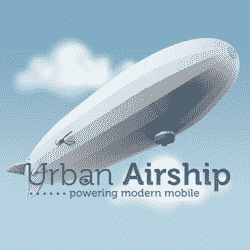

# Urban Airship 完成 540 万美元融资，帮助推动移动应用 TechCrunch

> 原文：<https://web.archive.org/web/https://techcrunch.com/2010/11/02/urban-airship-closes-5-4-million-funding-round-to-help-power-mobile-apps/>

# Urban Airship 完成 540 万美元融资，为移动应用提供支持

 [城市飞艇](https://web.archive.org/web/20221205173607/http://www.urbanairship.com/)，一家让移动应用开发者更容易提供推送通知、应用内购买和其他关键功能的初创公司，已经完成了新一轮 540 万美元的融资。B 轮融资由 Foundry Group 牵头，现有投资者 True Ventures 和 Founders Co-op 也参与其中。Foundry 集团的董事总经理杰森·门德尔森将加入 Urban 飞艇的董事会。

在高层次上，Urban Airship 允许移动开发者利用现代移动平台(如 iOS 和 Android)上常见的流行(和强大)功能，而不必为每个应用程序重新发明轮子。这些服务包括管理在多个平台上运行的应用程序的推送通知活动(支持 Android、黑莓和 iOS)。到目前为止，该公司表示已经分发了超过 10 亿条信息。Urban Airship 还提供与货币化相关的功能，包括一直流行的应用内购买。

Urban Airship 的最新功能是支持订阅，这肯定会在未来几年对出版商起到重要作用。这家初创公司为最近发布的《新闻周刊》(Newsweek)iPad 应用程序上的订阅提供了动力，这是第一份以此为特色的 iPad 期刊(如果更多的出版商转向这家初创公司来为他们的订阅提供动力，不要感到惊讶)。

其他客户包括 Tapulous、LivingSocial 和 Gowalla。Urban Airship 此前在 2 月份完成了一轮 110 万美元的融资，因此这使他们的总融资额达到了 650 万美元。