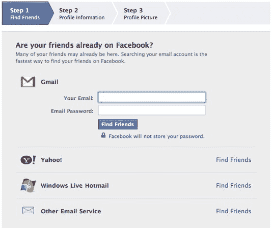

# 谷歌对脸书:没有互惠，你不能导入我们的用户数据

> 原文：<https://web.archive.org/web/http://techcrunch.com/2010/11/04/facebook-google-contacts/>

谷歌和脸书之间的战争正在升温:谷歌刚刚对其服务条款做了一个小小的调整，这将对世界上最大的社交网络产生重大影响。从现在开始，任何访问谷歌联系人 API 的服务——可以很容易地将你的朋友和同事的电子邮件地址列表导入到另一个服务中——都需要提供互惠。脸书没有，所以它将失去这个社交图谱的关键部分。

那么，用外行人的话说，这意味着什么呢？当你第一次注册脸书时，你会遇到一系列的提示，要求你输入你的谷歌账户信息，这样脸书就可以导入你的联系人的电子邮件地址。这是一个非常强大的功能，因为它可以帮助新用户立即与他们的许多朋友联系。谷歌关闭了它，因为它认为脸书没有公平竞争。

你看，脸书从来不允许用户导出他们朋友的联系信息。多年来，这一直是对社交网络的抱怨，因为从来没有一种简单的方法可以携带自己的数据离开脸书。但是你说什么？脸书[不是刚刚推出了](https://web.archive.org/web/20230211205016/https://techcrunch.com/2010/10/06/facebook-now-allows-you-to-download-your-information/)一个可以让你下载信息的新功能吗？

是和否。该功能允许您下载已上传的内容—照片、墙贴、视频、事件和消息。但是导出功能忽略了最有价值的一组数据:你的联系人。是的，脸书会给你一份他们的名单，但它不会附上任何联系信息:你不会得到他们的电子邮件地址、电话号码或其他任何其他服务可以用来在其他地方重建你的社交图的信息。

以下是对联系人 API 的[服务条款](https://web.archive.org/web/20230211205016/http://code.google.com/apis/contacts/api-terms.html)的相关补充:

> 5.8.谷歌支持数据可移植性。通过 Contacts Data API 或 Portable Contacts API 访问内容以在您的服务或应用程序中使用，您同意允许您的用户将其联系人数据导出到他们选择的其他服务或应用程序，其方式与从 Google Contacts 导出此类数据一样快捷方便，但要遵守适用的法律。

谷歌发言人给了我们这样的声明:

> 谷歌致力于让用户能够轻松地将自己的数据导入和导出谷歌产品。这就是为什么我们有一个致力于为用户构建导入和导出工具的数据解放工程团队。我们并不孤单。许多其他网站允许用户快速方便地导入和导出他们的信息，包括联系人。但是没有这样做的网站，比如脸书，让用户陷入了数据死角。
> 
> 因此，我们决定稍微改变我们的方法，以反映这样一个事实，即用户往往没有意识到，一旦他们将自己的联系人导入脸书这样的网站，他们实际上就被困住了。谷歌用户仍然可以自由地将他们的联系人从我们的产品中以一种开放的、机器可读的格式导出到他们的电脑中——一旦他们这样做了，他们就可以将这些联系人导入到他们选择的任何服务中。然而，我们将不再允许网站自动导入用户的谷歌联系人(通过我们的 API)，除非他们允许类似的导出到其他网站。
> 
> 重要的是，当我们将联系人自动转移到另一个服务时，用户可以确定新服务符合数据可移植性的基本标准。我们希望互惠将是创造一个真正的数据解放世界的重要一步——这一举措将鼓励其他网站也允许用户自动导出他们的联系人。

脸书过去曾声称，出口联系信息存在敏感问题。但这并没有阻止它尽可能地获取数据。它还与 Hotmail 和雅虎达成协议，允许这些服务访问它的联系数据。谷歌没有和脸书合作，所以它没有拿到货物。

这种联系数据的单向流动也不仅仅影响谷歌。今年早些时候，Twitter [推出了一项新功能](https://web.archive.org/web/20230211205016/https://techcrunch.com/2010/06/23/twitter-facebook-friends-linkedin/)，允许用户查看他们在脸书的哪些朋友也在 Twitter 上。在对正在发生的事情产生了一些困惑之后，脸书简单地[屏蔽了那个功能](https://web.archive.org/web/20230211205016/https://techcrunch.com/2010/06/23/facebook-blocks-twitter/)(显然是因为声称使用了太多的 API)，这非常可笑。几个月后，该功能仍然被禁用。

这让我们回到了谷歌为什么要这么做。脸书已经成为谷歌的一个主要威胁，因为它对社交图谱的独家所有权(即使它允许其他网站通过 Connect 访问它，所有的道路都要经过脸书)。谷歌死于自己的剑下是没有意义的，所以它将接受这一变化带来的媒体冲击，以便在社交媒体的战争中有更好的立足点。

是的，会有强烈的反对。谷歌长期以来从其承诺和促进开放中受益。这是朝着更加封闭的方向迈进，尽管谷歌将其定位为一种战略，以帮助网络在长期内变得更加开放。这可能最终会被证明是真的，但潜在的动机是明确的——这一切都是为了与脸书竞争。这也树立了一个丑陋的先例:如果谷歌感到受到威胁，它会相应地调整其开放程度。它肯定不是第一家这样做的公司，但它的“开放”之盾正在出现一些深深的裂缝。也就是说，谷歌仍然允许用户下载他们的联系数据(脸书根本不这么做)，所以它很难将用户锁定在这里。这只是让将你的谷歌数据上传到脸书的过程变得更加复杂。

那么，谷歌想从脸书那里得到什么？他们对互惠的定义要求任何访问其 Contacts API 的服务提供一个自己的具有类似功能的 API。这意味着它需要一个可以编程访问的 API，而不需要用户下载然后重新上传联系人数据的电子表格。接近谷歌的消息人士告诉我们，这一政策将根据具体情况而定。换句话说，谷歌不太可能去验证每一个访问其联系人 API 的初创公司都有自己的导出 API——他们只是去追踪大罪犯。

这不会导致脸书的毁灭——一点也不会。脸书可以从雅虎和微软的 Hotmail 等其他电子邮件提供商那里获取数据，它已经拥有了大量通过现有用户导入的信息。它还[收购了一家名为 Octazen 的公司](https://web.archive.org/web/20230211205016/https://techcrunch.com/2010/02/19/octazen-what-the-heck-did-facebook-just-buy-exactly-and-why/)，据我们所知，这是一个由专业数据采集员和联系进口商组成的精英团队。现在，它已经拥有了 5 亿用户的联系信息，我的预感是，脸书可以简单地要求你的 Gmail 电子邮件地址，并连接你到几十个联系人，甚至不需要访问谷歌的 API。

而且，如果真的到了这一步，脸书还有另外一种方法来获取谷歌的联系数据。谷歌仍将允许用户下载电子表格中的联系人——脸书可以简单地要求用户上传该文件。

我们已经联系了脸书进行评论，正在等待回复。

**更新:**见[数据保护主义开始认真](https://web.archive.org/web/20230211205016/https://techcrunch.com/2010/11/05/data-protectionism-begins-in-earnest/)