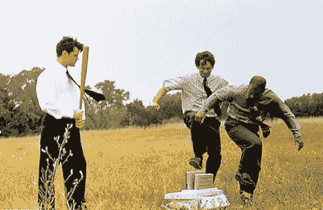

# 为什么产品很差(以及如何让它们不那么差)

> 原文：<https://web.archive.org/web/https://techcrunch.com/2010/11/06/why-products-suck-and-how-to-make-them-suck-less/>

***编者按**:以下客座博文由 [Expensify](https://web.archive.org/web/20230203171001/https://www.expensify.com/) 的创始人兼首席执行官[大卫·巴雷特](https://web.archive.org/web/20230203171001/http://www.crunchbase.com/person/david-barrett)撰写，他的口号是“不烂的费用报告”*

现在，你可能认为制造一个不可怕的产品对这个星球上的每一家公司来说都是显而易见的，几乎是荒谬的。事实上，谁会主张构建一个糟糕的产品呢？但事实是:很多产品*确实*烂。如此显而易见重要且被普遍认可的事情怎么会被如此少的人完成呢？

这是一个非常复杂的问题。但我认为这一切都可以归结为一个简单答案的变化:制造一个糟糕的产品比制造一个不糟糕的产品要容易得多。以下是为什么会这样的一些原因(以及你能做些什么):

**1。只需要一个人就能让你的产品烂透。**

我爱电影 *[十二怒汉](https://web.archive.org/web/20230203171001/http://www.imdb.com/title/tt0050083/)* 。(亨利·方达版本，不是托尼·丹扎版本。)是关于这个由 12 人组成的陪审团，其中 11 人走进陪审团室时确信被告有罪。但如你所知，陪审团只有在一致同意的情况下才能做出裁决，因此一个人就能够阻止快速定罪，并迫使陪审团审查证据和审议案件——一个接一个地说服每个人被告事实上是无辜的。这是一部伟大的电影，讲述了面对偏见、权宜之计和普遍的粗心大意，个人维护正义的力量。

不幸的是，你的团队不是陪审团。恰恰相反:任何人都可以让你的产品变得糟糕，往往在别人没有注意到的时候，已经来不及改变了，而且撤销起来非常昂贵。如果油箱盖卡住了，最快的赛车也动不了；你的产品的好坏取决于它最差的组件。不吸吮需要持续一致的同意——不是在细节上，而是同意不吸吮是值得努力的。而且你需要在没有保安潜伏在门外的情况下完成。

**建议**:向你的团队和全世界传达，不吸是你的首要目标。比新功能更重要，比新客户更重要——甚至比令人敬畏更重要——是简单的行为，不要持续地、全面地吮吸。每一个出色的功能都可能吸引一个新用户，但是每一个糟糕的功能都会让你失去两个用户。

**2。从来没有人因为差劲而被解雇。**

有句老话说“没有人会因为买了 IBM 而被解雇”。这可以追溯到 IBM 在长期占据主导地位后衰落的时候，当时显然有更好的产品可供选择，但选择它们的风险高于选择可靠产品的安全性。你随时都可能因为某件严重错误的事情被解雇，或者因为尝试了一些没有成功的疯狂的事情，或者因为做了一些让重要客户不高兴的事情或者失去了一笔大生意。但是没有人仅仅因为做了次优的事情而被解雇，尤其是当其他人都这么做的时候。太多时候，产品团队采取快速和肮脏的方式来获得特性，或者为了满足一些新客户而对“一行修改”让步。没有人会因为仅仅让某样东西满足硬要求而被解雇，即使它没有满足“不要吮吸”的“软”要求。

**建议**——招聘要慢，解雇要快。我知道每个人都在谈论杰出人士的重要性。但是就像不吮吸的重要性一样，这个标准在现实中很少被保持。维护它。有句话说“A 人雇佣 A 人，B 人雇佣 C 人。”做一个优秀的人，即使这意味着比你所希望的更长时间的无所事事。

**3。多吸比少吸容易。**

吮吸就像一个沥青坑:一旦你踏入其中，你的挣扎只会让你陷得更深。当你为了满足某个疯狂的顾客而对某个产品做出妥协后，你就必须永远支持这个环境，以免失去依赖它的顾客。然后其他客户找到它(因为如果你要构建它，为什么不给每个人呢？)，而这些客户有自己独特的要求，会让你陷入更深的困境。针对单个客户的一个随机复选框变成了针对具有深奥需求的小众人群的完整设置页面。支持这些客户会限制您支持其他客户的方式，影响您随时间升级数据结构的方式，阻止共享某些类型的代码，等等。焦油坑把你吸了下去，有时候唯一的出路就是原路返回，抛弃你最初争取来的客户，并且一路上惹恼你所有的其他用户。避免沥青坑需要惊人的纪律和毅力。这种情况很少发生，这不足为奇。

建议:不惜一切代价避开沥青坑，当被困时——尽管你尽了最大努力，这种情况还是会经常发生——如果有必要的话，砍掉自己的肢体，让自己回到正轨。即使这意味着惹恼 100%的用户:如果他们是错误的用户，这也是得到正确用户所必须发生的事情。

**4。吸的方法比不吸的方法多。**

任何负责构建某个功能的人都会立即被选择淹没。即使忽略在平台 Y 上呈现特性 X 的无数技术选项，每个可能的选择都有无限的子变化。像“这个链接应该是一个按钮吗？”"这个按钮应该在另一个按钮的左边还是右边？""点击它应该打开一个对话框还是一个新的页面？"单击按钮后是应该单击保存，还是该按钮会自动保存结果等等等等。如果说吮吸就像一个焦油坑，那么打造一个不吮吸的产品就像在拉布雷亚上空走钢丝。在雾中。有数不清的地方可以踩，但很少是在正确的道路上——通常直到你在齐腰深的柏油路上时，你才知道自己滑倒了。

建议:明确不吸吮对你意味着什么，并确保每个人都知道。即使线条模糊不清，也要画出来，并努力不断完善它们。你如何围着你的马车转远比你开枪的速度更重要。

**5。顾客需要劣质产品**。

不是故意的。但是他们要求你的产品具有令人沮丧的规律性。如果您的产品允许一些用户管理其他用户，情况就更是如此。有些功能他们认为自己需要但不需要，有些功能他们确实需要但别人不需要。世界上有几十亿人，你永远也不会满足他们中的一小部分。因此，要非常有选择性地让哪些人来决定你的路线图，并确保他们把它带到应许之地，而不是焦油坑。他们会威胁永远不使用你，或者退出，或者说你的坏话。有些人会坚持到底。但是大多数人最终会意识到你一直都是对的。也就是说，如果你一开始就是对的。

**建议**:相信你的直觉和一小部分使用你的用户，拒绝数十亿不相信你的人的建议。要么你对，要么你错。如果你是对的，坚持自己的观点会导致成功。如果你错了，最好根据你自己的优点快速失败，并在过程中学习一些东西，而不是接受那些从一开始就没打算用你的人的坏建议。

不要误解我:人们抱怨你的产品并不都是坏的。人们只会抱怨对自己重要的事情；抱怨总比不感兴趣好。而且并不是所有的抱怨都是平等的:抱怨你不支持特性 X 远胜于抱怨特性 Y 有多烂。

但是最终，如果你的用户讨厌你的产品，最终会有一个更好的替代品出现。在 [Expensify](https://web.archive.org/web/20230203171001/https://www.expensify.com/) ，我们试图按照这些规则生活，并创造出不差的产品。像任何理想一样，我不认为昂贵生活完全符合它们。如果你想看一看我们下一步的工作，想帮我们少吸点，请注册我们的 [Expensify 2.0 Beta](https://web.archive.org/web/20230203171001/https://spreadsheets1.google.com/a/expensify.com/viewform?hl=en&formkey=dDg1c0xpR0FJRjMxdTdnR3BzTVY5Qnc6MQ#gid=0) 。

大多数产品都很烂。但你的不需要，我们正尽最大努力确保我们的也不需要。我希望您能对我们的工作提出建议，或者对如何做得更好提出建议。