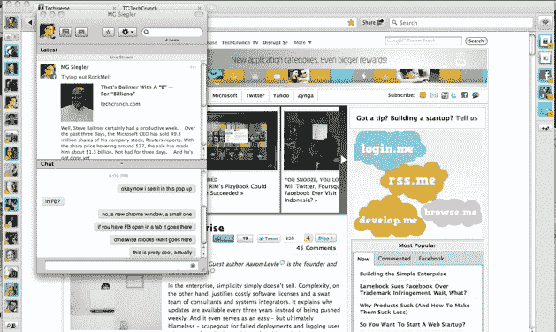

# RockMelt:专为分享而打造的浏览器(第一手资料和 500 份独家邀请)

> 原文：<https://web.archive.org/web/https://techcrunch.com/2010/11/07/rockmelt-browser-sharing-review/>

如果你打算从头开始创建一个新的浏览器，与谷歌、微软、Mozilla 和苹果竞争，你最好让它变得完全不同。由网景公司创始人马克·安德森支持的 rock melt(T2)公司一直处于保密状态，直到今天(T4)的 T3，该公司正试图从头开始建立一种新的浏览体验。他们疯了吗？“重要的是，”安德森说，“浏览器世界现在非常不稳定。”

RockMelt 首先是为共享而构建的。你和你的朋友一起浏览(你做的第一件事是登录脸书和你最喜欢的朋友，他们的最新状态更新总是在左边的轨道上)。顶部有一个很大的“分享”按钮，可以让你分享脸书上的任何网页、图片和预览。你可以称它为脸书浏览器，但它的功能远不止于此。我将很快进入我的完整评论，但如果你想亲自试用 RockMelt，请成为点击此链接的前 500 名 TechCrunch 读者之一— ***更新**:链接已被删除，因为邀请早就消失了*—你将比任何人都更早收到邀请。

你注意到的 RockMelt 浏览器的三个最大变化是它是围绕朋友、订阅源和搜索结果构建的。左边的栏杆是给朋友的。右边的轨道用于站点。顶部的横栏是用来搜索的。

你的脸书朋友和你一起沿着左边的栏杆浏览。你可以选择你最重要或最亲密的脸书朋友，他们的面孔会一直伴随着你，并显示他们是否在线。如果你将鼠标悬停在一张面孔上，就会弹出他们的最新状态更新。点击他们的脸，你会看到上半部分有一个显示他们的脸书流的框，下半部分有一个聊天框。因此，它作为一个即时通讯客户端使用脸书聊天(见下面的截图)。您甚至可以看到内嵌的图像和视频，这在脸书聊天中是很难看到的。如果您的朋友离线，您可以给他或她发送脸书消息。

沿着右边的轨道是你从你喜欢的网站组织你所有的新闻提要和信息流的地方。这有点像书签栏，但是当你在这里保存一个站点时，它还包括每次添加新内容时的通知。这对于新闻网站、博客、Gmail、Twitter 和你自己的脸书个人资料来说非常方便。(见下面截图)。点击一个网站图标，你会弹出一个覆盖窗口，上面有所有文章的 RSS 提要，或 Twitter 流，或你的电子邮件标题，这取决于该网站。点击标题，它会把你带到主浏览器窗口中的那个页面(或者电子邮件或推文)。每个提要条目都有一个分享按钮，就像浏览器顶部的大分享按钮一样。

当你在搜索框中搜索时，你得到的不是谷歌，而是前十个搜索结果。您可以浏览预加载到浏览器中的每个结果，因此您可以在整个浏览器中实际看到每个结果后面的网页。这是为了加快搜索速度，虽然至少一开始我发现自己在每个链接上跳来跳去，哪怕只有一两秒钟。

总的来说，RockMelt 似乎真的很快。它建立在 Chromium 之上，Chromium 是构成谷歌 Chrome 浏览器基础的开源浏览器。鉴于它得到了安德森(以及罗恩·康韦、比尔·坎贝尔、乔什·科佩尔曼和黛安·格林总计 1000 万美元)的支持，并且它的主要设计师也是网景浏览器的主要设计师，这是对 Chromium 作为浏览未来的一次相当重要的信任投票。“Chromium 是一个较新的代码库，”Andreessen 解释道。“这是最先进的技术。性能的提高令人难以置信。”他不喜欢怀旧。

基本的浏览功能都很熟悉，共享、流媒体和搜索覆盖看起来也不太显眼。这不是“羊群”( Flock )( T1 ),这种浏览器实验从未真正流行起来，因为它离大多数人的浏览舒适区太远了。RockMelt 将面临类似的挑战，但至少它的起步很简单。

RockMelt 试图引入的最大变化是引入不同的流作为自然的浏览体验和起点。事实上，这些叠加流(你朋友的更新、提要，甚至搜索结果)越来越多地占据了屏幕。

一年半前，当关于 RockMelt 的传言首次浮出水面时，我写了一篇[帖子](https://web.archive.org/web/20221231024720/https://techcrunch.com/2009/08/14/the-rockmelt-mystery-is-it-just-a-facebook-browser-or-will-it-break-the-mold/)，列出了我希望在社交浏览器中看到的功能。我很高兴地说，他们中的一些人以某种形式进入了 RockMelt。从愿望列表中:

*   它将有多种浏览、搜索、跟踪社交数据流和启动网络应用的模式
*   主页将是一个流阅读器，汇集来自网络的实时流(脸书现在已经有了 Friendfeed)。
*   即时消息、电子邮件和公共信息(状态更新和推文)总是可以在工具栏或侧边栏中看到
*   它将支持各种各样的网络应用程序，这些应用程序可以在浏览器中无缝启动，而无需登录网站。
*   来自整个网络的实时搜索和警报(社交流、新闻、金融网站、体育网站等。)

上周，我问安德森，他是否认为 RockMelt 是网页末日的先兆。他不会走这么远:

> 在未来的几十年里，网页仍然是主要的。它是任何应用程序或服务的通用画布。我认为你想保留这一点，但你想加强它。这就是为什么我们把页面放在前面和中间，但是把人们关心的东西放在里面:朋友、订阅、更新、搜索结果。

也许现在是这样。但最终，溪流接管了一切。这只是一种更有效的浏览方式。

但是关于岩石融化有一点。你登录它，它知道你在网上的任何地方，你所有的朋友是谁，你的搜索习惯是什么。它也知道你和你的朋友分享什么。将这三者结合起来:社交分享、搜索和实际浏览行为，你就有了一个针对人们的定向广告的好方法。RockMelt 现在不这么做了，它的创始人告诉我，他们永远不会这么做，因为这会摧毁人们对他们的信任。(该死的直)。“我们不会经营广告网络。联合创始人蒂姆·霍维斯说:“我们实际上不知道你去了哪里，这些信息不会离开你的浏览器。”但愿永远不会。

