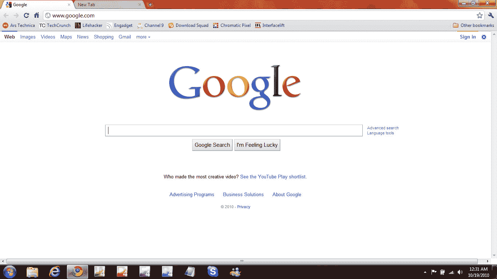
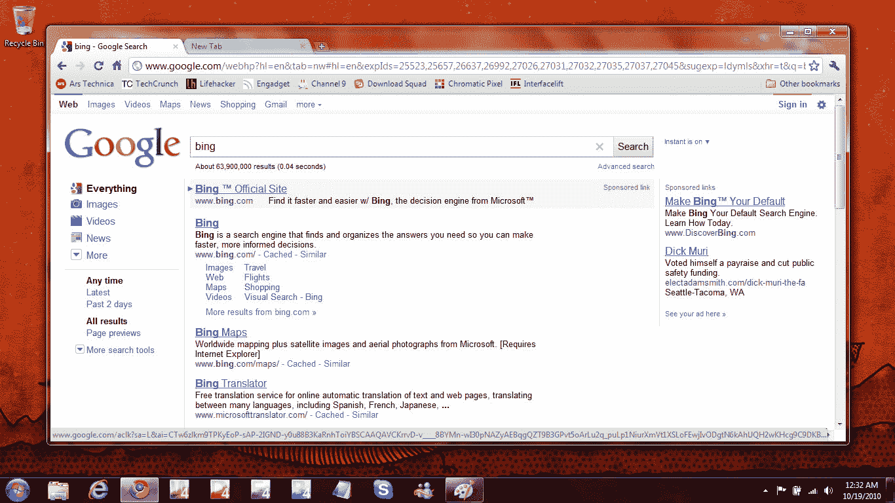
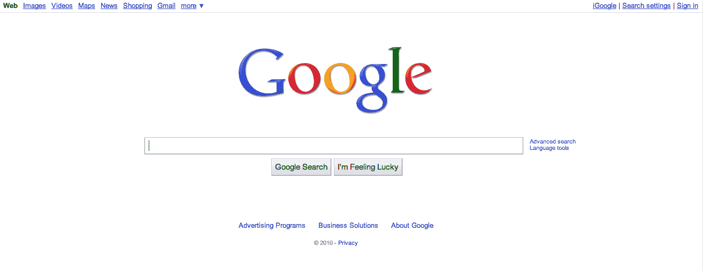

# 谷歌测试出更性感的顶部导航条

> 原文：<https://web.archive.org/web/http://techcrunch.com/2010/11/09/google-com-top-nav/>

# 谷歌测试出更性感的顶部导航条[图片]

谷歌从未因他们的设计能力而闻名。但是不可否认的是，在过去的[年里](https://web.archive.org/web/20230202215309/http://www.google.com/tenthbirthday/#homepage-original-prototype)，他们通过商标、按钮，甚至搜索框的升级，让 google.com 看起来更好了。现在看起来基本的顶部导航栏可能也要涂上一层新的油漆了。

正如你在下面的图片中看到的，谷歌目前正在测试一个新外观的导航条，它用一个更好看但更精致的工具栏取代了标准的蓝色下划线链接。你在导航中的位置现在不仅通过文本的变暗和加粗来表示，还通过你位置顶部的彩色条带来表示。例如，在图片中，你可以看到“网络”区域顶部的蓝色条，表示你正在进行网络搜索。

在最右边，你会注意到一个漂亮的大“登录”按钮(顶部有一个微妙的黄色条)，旁边有一个新的设置图标。

变化不是很大，但很好看。谷歌已经证实他们正在测试它，但只会说典型的:

> 在任何给定的时间，我们都在运行 50-200 个搜索实验。你可以在我们的博客上了解更多关于搜索实验的信息:[http://Google blog . blogspot . com/2006/04/this-is-test-this-is-only-test . html](https://web.archive.org/web/20230202215309/http://googleblog.blogspot.com/2006/04/this-is-test-this-is-only-test.html)

我怀疑这个实验将会在未来的某个时候在 google.com 出现。

*(点击图片放大)*

**新增:**

**旧:**

*【感谢泰德】*