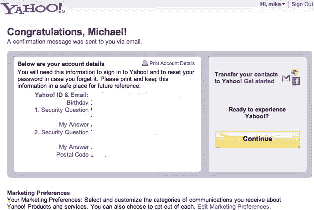
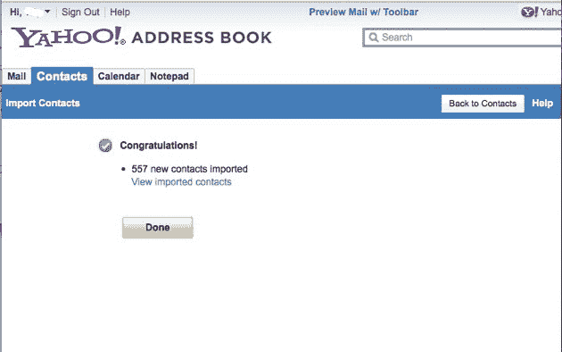
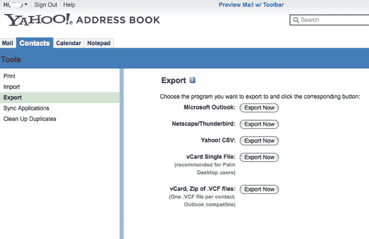

# 如何批量导出所有脸书朋友的私人电子邮件地址 TechCrunch

> 原文：<https://web.archive.org/web/https://techcrunch.com/2010/11/12/how-to-mass-export-all-of-your-facebook-friends-private-email-addresses/>

# 如何批量导出您所有脸书朋友的私人电子邮件地址

几天前，我请求脸书最终允许我们下载所有朋友的电子邮件地址。脸书说这是不允许的，因为你只拥有你添加到脸书的数据，而不是你朋友添加的数据。

他们的声明部分是(整个声明[在这里](https://web.archive.org/web/20230202212937/https://techcrunch.com/2010/11/09/facebook-slaps-google-openness-doesnt-mean-being-open-when-its-convenient/)):

> 对脸书来说，最重要的原则是每个人都拥有和控制自己的信息。每个人都拥有自己的朋友列表，但没有朋友的信息。一个人无权批量导出她所有朋友的私人电子邮件地址，就像她无权批量导出她所有朋友的私人相册一样。

我们指出，脸书已经允许通过与[微软](https://web.archive.org/web/20230202212937/https://techcrunch.com/2008/11/14/the-very-curious-microsoft-facebook-user-data-relationship/)、[雅虎](https://web.archive.org/web/20230202212937/https://techcrunch.com/2010/03/04/yahoo-contacts-gets-facebook-connect/)以及其他可能的合作伙伴的交易，大量输出朋友的私人电子邮件地址。我们建议脸书修改他们的声明，增加以下黑体字:

> 一个人无权批量导出她所有朋友的私人电子邮件地址，就像她无权批量导出她所有朋友的私人相册一样，**除非是和一个值得我们这么做的伴侣。**

无论如何，对于那些想下载所有电子邮件地址的人来说，这里有一些方法。

1.创建一个雅虎电子邮件帐户。即使您有一个旧的，创建一个新的，以便导入的接触是干净的。只需要一分钟。您将看到一个确认屏幕，如下所示。点击导入联系人“开始”链接，然后选择脸书。注意——不要使用 Chrome 浏览器，它在那个浏览器中不起作用。

2.授权雅虎在脸书弹出，然后等待几秒钟。您将看到如下确认屏幕:

3.好了，现在你已经把你所有脸书朋友的名字和电子邮件地址导入到雅虎了。现在只需点击雅虎邮箱中的“工具”并导出即可。CSV 格式是上传到 Gmail 或桌面通讯录的好格式。将文件保存到桌面上，就完成了。

4.享受您的新联系人。你刚刚使用脸书提供的工具做了一些脸书认为你无权做的事情。