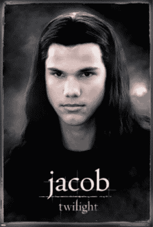

# Tatto Media 继续推出免费海报骗局 TechCrunch

> 原文：<https://web.archive.org/web/https://techcrunch.com/2010/11/12/tatto-media-continues-to-push-free-poster-scam/>

上个月，我写了一篇关于[新骗局](https://web.archive.org/web/20221007035801/https://beta.techcrunch.com/2010/10/18/free-posters-aka-scamville-its-back/)的文章，它在[斯卡维尔](https://web.archive.org/web/20221007035801/https://beta.techcrunch.com/2009/10/31/scamville-the-social-gaming-ecosystem-of-hell/)人群中表现得非常好——一张免费海报，与每月 30 美元的持续信用卡订阅捆绑在一起。

除了通过链接的条款和条件外，在任何结账页面上都没有披露正在进行的信用卡订阅。人们认为他们只是免费得到一张海报，外加 0.99 美元的运费。如果你打客户服务电话取消，你会被无限期地等待(我在挂断前 20 分钟一直在等待)。实际上，你甚至不会得到免费的海报(我没有，很多人抱怨)。

实际上，不给你寄海报也是骗局的一部分。一旦他们向你收费，他们就不希望你再想起他们。给你寄一张海报只是提醒你检查你的信用卡账单，你会看到一笔 30 美元的费用。

上个月我和 Tatto Media 的首席执行官谈话时，他否认知道这个骗局。他还说他把优惠撤了，事实上显示优惠的页面也被撤了。

当然，现在随着媒体周期的结束，它又回来了。Tatto 再次向分支机构推销这个骗局。这是他们今天刚发来的邮件:

> 主题:激励要约
> 日期:Fri，2010 年 11 月 12 日 10:09:42 -0500
> 发件人:泰勒
> 至:
> 
> 嘿，
> 
> 很久没说话了..希望你过得好。我想让你知道，我们有一个内部激励方案，在 GPT 的其他网站上做得非常好，所以我想让你知道，如果你还没有尝试过的话。报价是 Wozo.com，我不确定是否有一个叫 Andrew 的人已经联系你让你直接跑，但通过我跑也是一样的。这是一种没有促销限制的信用卡服务(现金奖励和内容锁定就可以了)。支出是 18 美元注册会计师…让我知道你是否有兴趣或你有其他问题。
> 
> 最好的，
> 
> 泰勒
> 客户经理

我又一次给 Tatto 的 CEO 发了邮件，想听听他今天在胡说些什么。如果有回音，我会更新。

我以前说过，现在还想再说一遍。这些骗局可能会让你们中的一些人认为“买家当心”，但这些公司能够不断调整报价，以确保最大的转化率和利润。而这一切最终都会流向我们每天都在谈论的“合法”公司——谷歌、脸书、Zynga 等等。阻止它的唯一方法是继续向它照射阳光，并向食物链顶端的公司施加压力，禁止它。