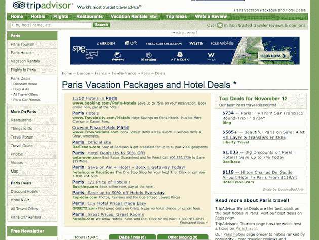
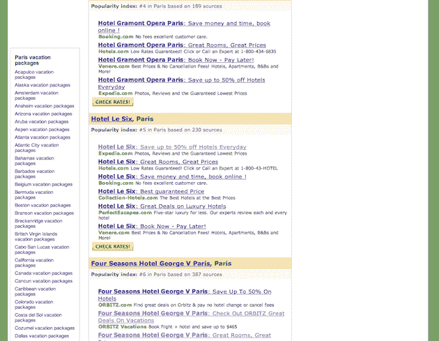
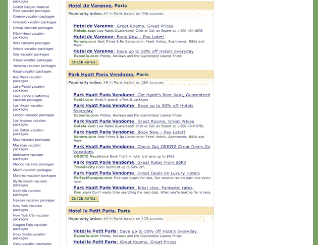
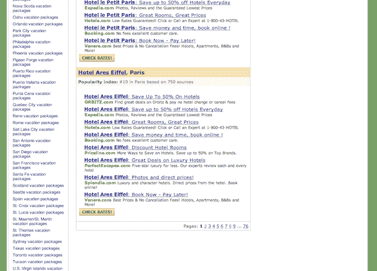

# *广告在这里*猫途鹰:计划*广告在这里*你的假期*广告在这里*广告在这里*广告在这里*请

> 原文：<https://web.archive.org/web/https://techcrunch.com/2010/11/12/tripadvisor-is-a-great-advertisement/>

# *广告在这里*猫途鹰:计划*广告在这里*你的假期*广告在这里*广告在这里*请在这里

所以， [LeWeb '10](https://web.archive.org/web/20230203040229/http://www.leweb.net/) 要来了 [up](https://web.archive.org/web/20230203040229/https://techcrunch.com/2010/10/31/leweb-2010/) 。比方说，你正在寻找一些好主意，想知道在巴黎住在哪里，做些什么。你在网上最有可能打开哪里？谷歌。搜索“[巴黎度假](https://web.archive.org/web/20230203040229/http://www.google.com/search?aq=f&sourceid=chrome&ie=UTF-8&q=%22paris+vaction%22#sclient=psy&hl=en&q=paris+vacation&aq=f&aqi=g10&aql=&oq=&gs_rfai=&psj=1&fp=8d8dc79919fbb9a2)”会得到猫途鹰作为首要结果。你点击[链接](https://web.archive.org/web/20230203040229/http://www.tripadvisor.com/Packages-g187147-Vacation-Package-Discount-Paris_Ile_de_France.html)。

哦。我的。上帝啊。

你在顶部会看到一个横幅广告。在那之下，你得到 10 个赞助链接。右边是会员链接。在此之下，数百个附属链接。还有更多横幅广告。这一页上没有一条真正的内容。这是一个巨大的广告。这有 76 页。

呕吐。

这基本就是尝试在网上做旅行调研的状态。这是一个巨大的搜索引擎优化游戏，它为赢家带来了大量的流量，然后他们通过广告和附属链接来赚钱。对于最终用户来说，这或多或少是世界上最糟糕的体验。

你在假期做研究，你想看这个地方的大而漂亮的照片，一些评论，你信任的人的推荐。取而代之的是，你会得到成百上千的付费链接。这几乎像是一个笑话。

全球数百个城市的谷歌搜索结果也好不到哪里去。也许这就是为什么我们确实需要像 T2 这样的东西。也许我们需要人类，他们不能被游戏，[帮助结果](https://web.archive.org/web/20230203040229/https://techcrunch.com/2010/07/19/techcrunch-review-the-blekko-search-engine-prepares-to-launch/)。如果有人在玩游戏，我们需要透明度来看看是怎么玩的，为什么玩，是谁玩的。我不知道。我只知道现在的这个系统真的坏了。

为猫途鹰把这些垃圾放在那里感到羞耻。这足以让你想去找旅行社。

你走到这一步了吗？令人印象深刻。