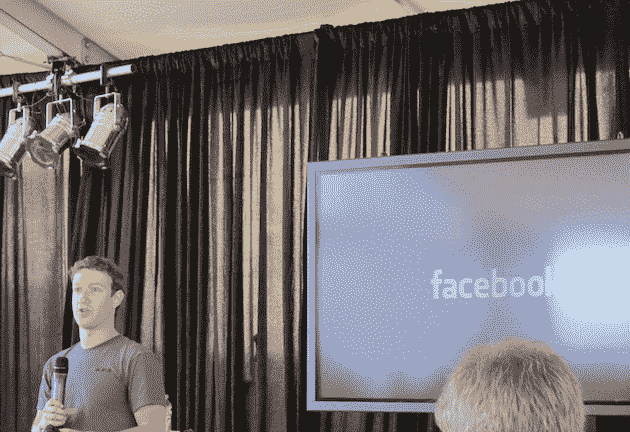
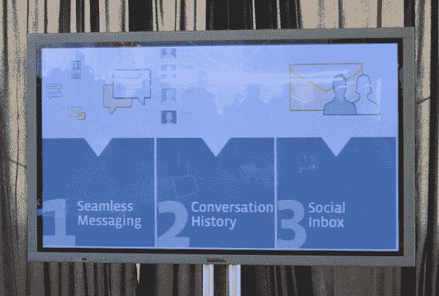

# 脸书的现代信息系统:无缝、历史和社交收件箱

> 原文：<https://web.archive.org/web/https://techcrunch.com/2010/11/15/facebook-messaging/>

我们今天在旧金山的瑞吉酒店[这里是](https://web.archive.org/web/20230404075902/https://techcrunch.com/2010/11/15/facebook-email/)，脸书在这里推出了被首席执行官马克·扎克伯格称为“现代信息系统”的产品。

扎克伯格回忆起最近与高中生交谈，问他们如何相互交流。他们不喜欢电子邮件。扎克伯格指出:“*这太正式了*”。因此，大约一年前，脸书着手彻底改革这一体系。但这不仅仅是电子邮件。

"*这不是邮件杀手。扎克伯格说:“这是一种包括电子邮件在内的信息体验。都是为了让沟通更简单。“这是未来应该工作的方式，*”他继续说道。

根据扎克伯格的说法，以下是现代信息系统需要的关键:

*   无缝的
*   非正式的
*   马上
*   个人的
*   简单的
*   最小的
*   短的

为了做到这一点，脸书创造了三个关键东西:无缝信息、对话历史和社交收件箱。从本质上说，他们创造了一种沟通方式，无论你想用什么格式:电子邮件，聊天，短信，他们都包括在内。工程师安德鲁·博斯沃思说:“人们应该分享他们想分享的东西。

所有这些信息都保存在一个社交收件箱中。您与他人的所有对话历史都会保留下来。

除了 Facebook.com 上的产品，这也将在他们的移动应用程序上运行。一个更新的 iPhone 应用程序即将推出。博斯沃思指出，在旅途中保持信息畅通非常重要。

但是不需要 app。值得注意的是，这也适用于短信。

是的，如果愿意，每个人都可以获得一个@facebook.com 电子邮件地址。但是他们不需要得到一个——你可以使用任何电子邮件地址。是的，IMAP 支持也即将到来(但不是现在)

为了使这项工作成功，“我们不得不完全重建这个系统所依赖的基础设施，”博斯沃思指出。人们知道脸书的 Cassandra 系统，但现在他们已经建立了一个新的东西，叫做 hBase(再次与开源社区一起工作)。

他说有 15 名工程师致力于这个产品——值得注意的是，这是有史以来在单个脸书项目上工作的最多的一次。

现在，这个系统正在融合四个主要的东西:短信，即时消息，电子邮件和脸书信息。扎克伯格说他们会考虑其他技术，比如未来的网络电话。但是现在这主要是关于巩固基于文本的信息。

扎克伯格说，在接下来的几个月里，这个信息系统将会非常缓慢地推出。

**更多** : [扎克伯格:我们的系统不是电子邮件黑仔。但是如果它因此而死亡…](https://web.archive.org/web/20230404075902/https://techcrunch.com/2010/11/15/facebook-email-killer/ "Zuckerberg: Our System Is Not An Email Killer. But If It Dies As A Result…")

