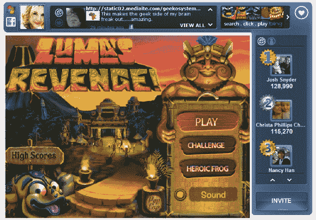
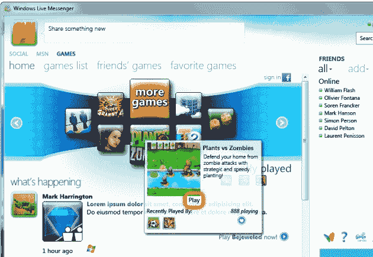

# 不那么随意:微软将重振 MSN 游戏、Live Messenger 和 Bing 游戏 TechCrunch

> 原文：<https://web.archive.org/web/https://techcrunch.com/2010/11/15/not-so-casual-microsoft-to-revitalize-msn-games-live-messenger-and-bing-games/>

[微软](https://web.archive.org/web/20221031052213/http://www.crunchbase.com/company/microsoft)今天早上[宣布](https://web.archive.org/web/20221031052213/http://www.prnewswire.com/news-releases/microsoft-infuses-social-experiences-into-casual-games-108151294.html)几项新的努力，以在蓬勃发展的社交/休闲游戏市场获得一些地盘。该公司将首次推出全新版本的 MSN 游戏([见此处预览](https://web.archive.org/web/20221031052213/http://games.msn.com/#/Homepage))，为即时通讯客户端 Windows Live Messenger 带来新的社交游戏，并在国际上扩展必应游戏。

最后但同样重要的是，微软已经与社交游戏发行商 [CrowdStar](https://web.archive.org/web/20221031052213/http://www.crunchbase.com/company/crowdstar) 达成合作，将一些最受欢迎的游戏引入微软的各种休闲游戏产业。

微软个人电脑和移动游戏高级全球总监凯文·乌南斯特(Kevin Unangst)表示:

> “MSN Games、Windows Live Messenger 和 Bing 每个月都会接触到数百万消费者，我们第一次将所有这些玩家和他们的社交圈联系在一起，以一种出色的游戏体验为中心。”

今天下午晚些时候，该公司休闲游戏组合的最新成员是新 MSN 游戏的预览版，它让互联网用户在线玩游戏，并在一个集中的环境中挑战他们的脸书和 Windows Live 朋友，以击败他们的高分。新的 MSN 游戏网站将展示一个新的设计，并且还将展示来自 MSN 娱乐[的“实时娱乐新闻”。](https://web.archive.org/web/20221031052213/http://entertainment.msn.com/)

随着本周的发布，微软正在将其休闲游戏属性捆绑在一起，以建立一个跨 MSN 游戏、 [Windows Live Messenger](https://web.archive.org/web/20221031052213/http://explore.live.com/windows-live-messenger) 和 [Bing](https://web.archive.org/web/20221031052213/http://www.crunchbase.com/product/bing) 的统一游戏体验。所有这三个游戏属性都通过一个名为[微软游戏中心](https://web.archive.org/web/20221031052213/http://www.microsoft.com/presspass/features/2010/nov10/11-15GameHub.mspx?rss_fdn=Top%20Stories)的新社交功能连接起来，该功能本质上旨在为你最喜爱的休闲游戏添加“更多你的个性和朋友”(基于你的[脸书](https://web.archive.org/web/20221031052213/http://www.crunchbase.com/company/facebook)和/或 Windows Live 个人资料)。

这将是它的样子:

请注意，这与 Windows Phone 的[游戏中心](https://web.archive.org/web/20221031052213/http://www.microsoft.com/windowsphone/en-us/howto/wp7/apps/games-hub.aspx)没有任何关系，至少根据我今天的声明来看没有。

微软希望这些声明能引起游戏开发商和发行商的共鸣。

Xbox 产品营销经理亚历克斯·汀斯曼说:

> “微软游戏中心真的开辟了新的领域，因为一个包装器就能让所有东西立即社交化。”这对出版商来说意味着他们只写一次，然后发布到任何地方。"

除了上述举措之外，微软宣布 [Bing Games](https://web.archive.org/web/20221031052213/http://www.bing.com/games) 从此面向美国以外的其他英语市场的用户开放，如澳大利亚、加拿大、英国和新西兰。Bing Games 补充说，迄今为止，已经有超过 5500 万个游戏直接在浏览器中运行。

必应也将是微软第一个拥有众星游戏的休闲游戏平台，众星游戏将于 12 月中旬加入必应。这家脸书游戏制造商表示，目前其月活跃用户约为 5000 万。

微软指出，Windows Live Messenger 仍然是世界上最受欢迎的即时消息网络之一，每天发送超过 90 亿条消息。今天，该公司正在把新的微软游戏中心的社交功能和来自 iWin、PopCap、Arkadium、GameHouse 等出版商的一系列产品注入这些即时消息聊天中。

Messenger 中的新游戏选项卡将于今天晚些时候在美国、英国、法国、加拿大、西班牙、墨西哥、巴西、意大利、德国、荷兰和土耳其推出。微软表示，今年晚些时候将增加更多的市场，虽然游戏标签用户界面将在所有这些市场进行本地化，但游戏本身将只使用英语。

发布时，将有超过 35 款游戏可以在 MSN Games、Windows Live Messenger 和 Bing 上连接和玩，包括 iFresh Games 的“Cubis 2”和 PopCap 的“植物大战僵尸”。

微软补充说，未来它将与更多的发行商和“精心挑选的来自游戏机、手持设备、移动设备和在线平台的流行和广受好评的游戏”一起完善其产品组合。

提醒一下，我们早在 7 月份就报道过，谷歌正在[策划推出](https://web.archive.org/web/20221031052213/https://beta.techcrunch.com/2010/07/10/google-secretly-invested-100-million-in-zynga-preparing-to-launch-google-games/)谷歌游戏，并且已经向社交游戏巨头 [Zynga](https://web.archive.org/web/20221031052213/http://www.crunchbase.com/company/zynga) 投资了超过 1 亿美元(Zynga 也与雅虎建立了[合作关系)。](https://web.archive.org/web/20221031052213/https://beta.techcrunch.com/2010/05/26/zynga-continues-to-expand-beyond-facebook-forges-major-partnership-with-yahoo/)

可以有把握地得出结论，随着网络巨头继续加强他们的休闲游戏努力，我们可以预计这个市场将进一步升温。