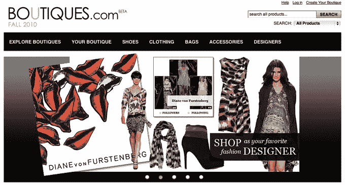

# 谷歌用 Boutiques.com TechCrunch 推出时尚、个性化购物和喜欢的视觉搜索

> 原文：<https://web.archive.org/web/https://techcrunch.com/2010/11/17/google-boutiques/>

作为一个狂热的网上购物者和热爱时尚的人，我总是发现谷歌的产品搜索缺乏任何美学吸引力。图片小，滤镜太基础，不适合超级购物和注重时尚的人群；整体设计不吸引人。虽然产品搜索的格式可能适用于电子产品的搜索，但它不适用于想买衣服、手袋或鞋子的人。总的来说，谷歌缺乏一个合适的视觉搜索选项来提供软商品购物体验。这就是为什么谷歌[收购了 Like.com，](https://web.archive.org/web/20221218150710/https://techcrunch.com/2010/08/20/its-official-google-acquires-like-com/)一个[视觉搜索引擎](https://web.archive.org/web/20221218150710/https://techcrunch.com/2006/11/08/riyas-likecom-is-first-true-visual-image-search/)和时尚购物网站网络。今天，随着[Boutiques.com](https://web.archive.org/web/20221218150710/http://www.boutiques.com/)[期待已久的](https://web.archive.org/web/20221218150710/https://techcrunch.com/2010/11/15/google-to-enter-fashion-shopping-territory-with-launch-of-boutiques-com/) [发布](https://web.archive.org/web/20221218150710/http://googleblog.blogspot.com/2010/11/introducing-boutiques-new-way-to-shop.html)，谷歌终于踏入了时尚、电子商务、视觉搜索、个性化购物和设计师推荐的世界。

简而言之，Boutiques.com 在快速的谷歌搜索引擎中融合了 Like.com 的精华。Boutiques.com 结合了购物的元素[个性化引擎](https://web.archive.org/web/20221218150710/https://techcrunch.com/2009/06/03/covetcom-will-be-your-stylist-and-personal-shopper-in-one/)Covet.com；街头风格[社交网络](https://web.archive.org/web/20221218150710/https://techcrunch.com/2009/11/18/like-com-acquires-street-style-fashion-community-weardrobe/)[weardobe、](https://web.archive.org/web/20221218150710/http://www.weardrobe.com/)和[视觉造型工具](https://web.archive.org/web/20221218150710/https://techcrunch.com/2010/02/23/like-com-expands-digital-fashion-empire-with-virtual-styling-tool-couturious/)[couture us。](https://web.archive.org/web/20221218150710/http://www.couturious.com/)

该网站既是所有时尚产品的搜索引擎，也通过名人、造型师和设计师策划的精品店提供个性化的购物体验。用户还可以创建账户，发布自己的精品。Like.com 的首席执行官和创始人 Munjal Shah 现在是谷歌的员工，帮助领导 Boutiques.com 的产品设计，他带领我们浏览了网站的界面。我将在下面讨论 Boutiques.com 的两个组成部分。

**搜索**

对 Boutiques.com 的搜索与你在 Like.com 的搜索相似，但都是在类固醇上。您可以搜索特定商品，并根据颜色、轮廓、图案、尺寸、风格、商家等进行过滤。在你的搜索结果旁边(默认情况下将处于“查看全部”模式)，Boutiques.com 将展示与你在 Weardrobe 和 Couturious 上的搜索相匹配的服装。因此，如果我搜索一件蓝绿色的连衣裙，精品店会向我展示用户贡献的外观，包括 Weardrobe 的蓝绿色连衣裙以及与我在 Couturious 的搜索匹配的专业风格的外观。该网站还将展示 Polyvore(谷歌不拥有)的外部风格选项。

**精品店**

Shah 将网站上的精品店元素比作 Pandora，在这里你可以创建自己的电台，并根据自己的喜好和行为接收个性化的音乐推荐。在这个网站上，你可以找到由设计师和名人策划的服装、鞋子、款式、手袋等迷你精品。用户也可以根据自己的喜好创建自己的精品店。精品店中的所有商品都可以购买(像任何搜索引擎一样，你可以点击进入商家网站购买商品)。

用户可以向 Boutiques.com 注册，并开始关注名人、设计师和其他用户推荐的某些精品店。使用 Covet.com 的个人造型工具，问你一些问题来确定你的风格，谷歌也会向你推荐类似的精品。用户也可以评论精品。

截至目前，谷歌已经积累了名人和设计师的名人录，以策划他们自己的个性化精品店。有 30 多位设计师在发布会上赞助了精品店，包括托里·伯奇、艾萨克·麦兹拉西、凯特·斯派德、露露·吉尼斯、玛切萨、奥斯卡·德拉伦塔、拉格和波恩、丽贝卡·泰勒、特雷西·里斯、贝琪·约翰逊、黛安·冯·芙丝汀宝、哈斯顿遗产、妮可·米勒、安娜·苏和贝格利·米施卡。

在发布会上策划精品店的名人包括安娜·帕奎因、奥尔森姐妹组合、阿什丽·辛普森·华斯、凯瑞·穆丽根、伊丽莎白·莫斯、伊曼、简·克拉考斯基、凯莉·奥斯本和拉什达·琼斯。

**IPAD 应用**

沙阿说，iPad 已经成为购物和浏览网页的必备设备，因此为 Boutiques.com 推出配套的 iPad 应用程序是有意义的。免费的 iPad 应用程序将包含与网站相同的所有功能。

与 Like.com 的商业模式类似，Boutiques.com 将基于每次点击成本盈利，在线商家将根据用户点击其网站上产品的次数向谷歌支付费用。

沙阿说，Like.com、Weardrobe、Couturious 和视觉搜索引擎网络中的其他网站最终将会退出，但没有一个固定的时间表。

对于谷歌来说，Boutiques.com 无疑是一个不同的方向，谷歌的电子商务和购物选择并没有太多可谈的。除了搜索之外，该网站的另一个有趣之处是个性化和社交功能。我也很好奇谷歌是否会添加任何其他社交购物功能(如与脸书或推特的整合)。最后，搜索功能，这是谷歌的面包和黄油，令人印象深刻，无疑将使该网站吸引网上购物。本周早些时候，谷歌刚刚提升了它的一般产品搜索。

关于 Boutiques.com，另一件值得注意的重要事情是，它似乎对女性很有吸引力。针对这一人群的购物代表着一个巨大的市场，也是易贝[一直在大力推动的市场。](https://web.archive.org/web/20221218150710/https://techcrunch.com/2010/04/05/ebay-launches-special-online-store-for-all-things-fashion/)

但谷歌的优势在于它有能力从网络上的零售商那里集中采购产品，而不是从一个单一的电子商务平台采购。正如沙阿所说，最终“谷歌的愿景是帮助人们找到并购买世界上所有的产品。”

