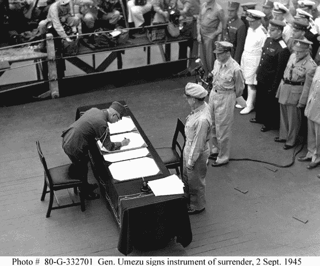

# 随着 MySpace 向脸书彻底投降，地狱冻结了

> 原文：<https://web.archive.org/web/https://techcrunch.com/2010/11/18/hell-freezes-over-as-myspace-fully-surrenders-to-facebook/>

# 当 MySpace 完全臣服于脸书时，地狱冻结了

就在几年前，MySpace [还不怎么关心](https://web.archive.org/web/20230213063001/https://techcrunch.com/2008/11/06/liveblogging-myspaces-chris-dewolfe-and-warner-musics-edgar-bronfman-at-web20-music-music-music-and-money/)快速发展的脸书。一晃两年过去了，首席执行官换了几个，一切都变了。

去年夏天，MySpace [找到了一种方法](https://web.archive.org/web/20230213063001/https://techcrunch.com/2010/08/30/myspace-tries-to-pollute-facebooks-stream/)让 MySpace 状态更新进入脸书。今天中午，在一个除我们之外的所有人都被邀请参加的[特别新闻发布会上，他们将宣布更多的集成。我们没有被邀请也没关系，因为我们现在确切地知道他们要宣布什么。](https://web.archive.org/web/20230213063001/http://www.businessinsider.com/facebook-and-myspace-schedule-joint-announcement-for-thursday-2010-11)

这个活动与其说是宣布合作，不如说是一个正式的移交仪式。

MySpace 将派首席执行官迈克·琼斯出席发布会。脸书设法找到了一位副总统——丹·罗斯。我们的消息来源称，MySpace 对脸书没有派更高级的人来参加这个活动感到有点尴尬。

这至少是他们将要宣布的部分内容。脸书连接集成，以便用户可以将他们的 MySpace 帐户与他们的脸书帐户相关联，然后通过连接登录到 MySpace。[那个](https://web.archive.org/web/20230213063001/http://www.myspace.com/signup)的一部分已经活了。MySpace 将尽可能多地吸收个人资料信息，并用它来帮助广告和兴趣图(你喜欢的乐队，等等。)

他们还将宣布，脸书用户现在可以将他们所有的脸书状态更新推送到 MySpace。因此，您的脸书流将出现在您的 MySpace 个人资料中。

现在，MySpace 要做的就是想办法让至少一部分用户偶尔在 MySpace 上闲逛，而不仅仅是在脸书。他们最近的重新设计就是这种努力。几个月后，我们都会知道它是否有效，以及 MySpace 是否有任何长期业务。