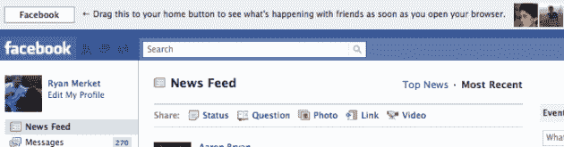
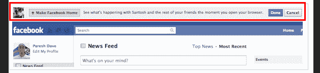
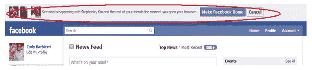

# 脸书争相成为你的主页——为什么这是一件大事

> 原文：<https://web.archive.org/web/http://techcrunch.com/2010/11/21/facebook-homepage/?utm_source=feedburner&utm_medium=email&utm_campaign=Feed%3A+Techcrunch+(TechCrunch>&utm_content=Yahoo!+Mail)

# 脸书争相成为你的主页——为什么这是一件大事

这是一个非常古老的把戏，也可以说是非常有效的一个。让人们把你的网站设置为他们的主页，这将成为他们进入网络的入口，当他们打开浏览器时，首先看到的就是它。 [Venturebeat](https://web.archive.org/web/20230202214907/http://venturebeat.com/2010/11/18/facebook-homepage/) 注意到，脸书在周末前开始提示访问者将该网站设置为他们的主页，通过顶部的一个栏，实际上显示一些你的脸书朋友的照片和名字。

其他人[报告](https://web.archive.org/web/20230202214907/http://www.neontommy.com/news/2010/11/facebook-wants-become-your-homepage-pop-moment-you-open-your-browser)也看到酒吧突然出现，来自 [Appbistro](https://web.archive.org/web/20230202214907/http://appbistro.com/) 的读者 [Ryan Merket](https://web.archive.org/web/20230202214907/http://www.crunchbase.com/person/ryan-merket) 刚刚登记告诉我们他也看到了。您可以在下面看到另外两个弹出消息，您会注意到它们与上面嵌入的消息不同。

从表面上看，脸书正在用一小部分用户进行 A/B 测试，并尝试各种消息和弹出布局，以找出哪一种能产生最好的结果。

不可否认，这是一个重大举措，特别是当它将全面推广到该网站大约 5 亿活跃用户时。请记住，谷歌和其他搜索引擎从成为网络其他部分的真正起点中受益匪浅，这就是为什么这么多人选择这些服务，只要他们打开网络浏览器就会出现。

成为人们的主页有利于品牌，有利于‘粘性’和显著的流量。

但对很多人来说，社交网站正在慢慢接管至少部分搜索引擎的角色，主要是检索信息。当你可以从你的整个社交图谱中找到你的问题的答案时，像脸书这样的网站有能力推开像谷歌这样的搜索引擎，成为人们想到在网上冲浪寻找信息时首先想到的网站，[与其他人联系](https://web.archive.org/web/20230202214907/https://techcrunch.com/2010/11/21/talking-to-people-so-over/)，[与朋友交流](https://web.archive.org/web/20230202214907/https://techcrunch.com/2010/11/15/facebook-350m-people-using-messaging-more-than-4b-messages-sent-daily/)等等。

我很容易理解为什么越来越多的人最终会选择脸书作为他们的主页，并且积极地鼓励他们这样做可能正是一些脸书用户需要配置他们的浏览器来做到这一点。

仔细想想，我想知道为什么脸书没有永远这样做。

除了上升，脸书的流量仍然很少，但如果他们能说服总用户群中的一小部分人将 Facebook.com 作为主页，那么这个社交网络的总浏览量和在网站上停留的时间仍然会大幅增加。

也就是说，你已经把 TechCrunch 设为你的主页了，对吧？

