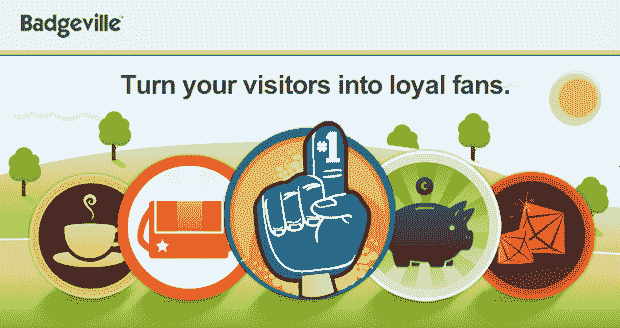

# Badgeville 的投资者现在下注 250 万美元，赌你会想登录网站 TechCrunch

> 原文：<https://web.archive.org/web/http://techcrunch.com/2010/11/22/badgeville-investment/?utm_source=feedburner&utm_medium=feed&utm_campaign=Feed%3A+Techcrunch+(TechCrunch>)

# Badgeville 的投资者现在下注 250 万美元，赌你会想登录网站

TechCrunch Disrupt Audience Choice 赢家 [Badgeville](https://web.archive.org/web/20230202215135/http://badgeville.com/) 今天宣布进行一轮 250 万美元的首轮融资，以便在网络上应用其基于徽章的游戏机制。本轮投资者包括 Felix Investments 的易贝·首席运营官·梅纳德·韦伯、Palantir 创始人乔·朗斯代尔、佩曼·诺扎德和扎因·汗，以及 Paypal、Chegg、Shopping.com、Drugstore.com 和华纳音乐的高管。

使用 Badgeville 的出版商可以建立一个账户，提供规定的奖励，并通过实时分析跟踪访问者的行为。Badgeville 为任何在其网站上有社区的公司工作:从游戏到教育，到零售等任何人都可以使用这项服务来奖励人们登录网站，参加测试或简单浏览产品。几乎任何东西都可以对应徽章奖励。

自从他们在 TechCrunch Disrupt 上发布[以来，这家初创公司已经有超过 1500 家公司询问信息，并与数十家合作伙伴签约，包括康卡斯特体育、Philly.com、](https://web.archive.org/web/20230202215135/https://techcrunch.com/2010/09/27/badgeville/)[The Next Web、](https://web.archive.org/web/20230202215135/http://thenextweb.com/)black book 和我们。 创始人 [Kris Duggan](https://web.archive.org/web/20230202215135/http://www.crunchbase.com/person/kris-duggan) 和 Wedge Martin 预计 2010 年的预订收入将超过 100 万美元(在他们开业的前四个月内)，并将人们对 Badgeville 的兴趣的涌入归因于当前的混合趋势*“社交+游戏+忠诚度+网络分析”，*OneTrueFan 和 Big Door 共享的空间。

达根说，*“**每个人都意识到他们想要 Foursquare 和 Farmville 拥有的东西。在未来，几乎每一个严肃的网络品牌都将拥有社交游戏技巧来吸引用户。我们是这样做的公司。”*

这家初创公司计划利用这笔融资来增加员工，进一步进行产品工程设计，并支持其大规模客户。Duggan 告诉我，他们计划在未来 12 个月内将他们在帕洛阿尔托的办公室从 10 名员工扩大到 20-30 名，并且像其他人一样在招人。