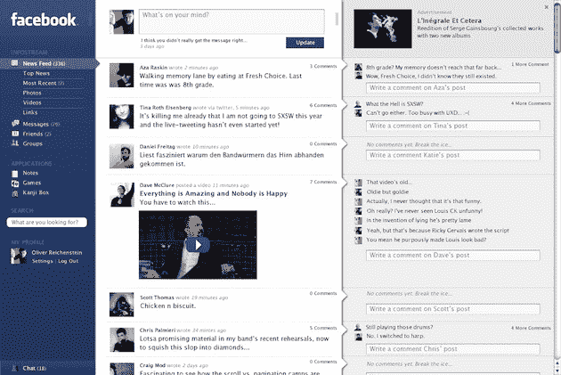
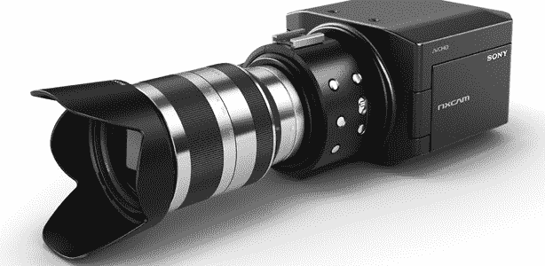
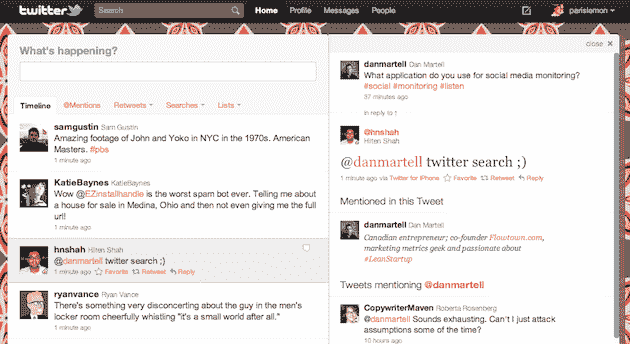
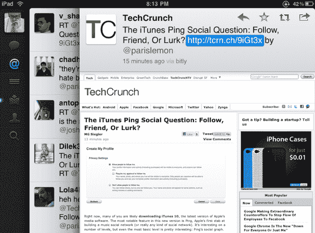

# 为什么脸书看起来不像这样？因为 Twitter 有。TechCrunch

> 原文：<https://web.archive.org/web/http://techcrunch.com/2010/11/22/facebook-twitter-design/>

# 为什么脸书看起来不像这样？因为 Twitter 有。

回到今年 4 月，我发了一个帖子，问题很简单:[为什么脸书不像这个](https://web.archive.org/web/20230202214132/https://techcrunch.com/2010/04/21/facebook-design/)？帖子包含了日本设计公司 [iA 在 2006 年末/2007 年初为](https://web.archive.org/web/20230202214132/http://www.informationarchitects.jp/en/ias-2006-facebook-designs-redesigned/)公司重新设计脸书的截图。脸书最终没有采用这些想法，但不可否认，它们看起来很棒。事实上，再看一遍，它们看起来很熟悉。他们看起来像新的推特。

嗯，从技术上来说，整体概念有点像 iPad 的 Twitter(三窗格视图)。但它与新 Twitter 有许多相同的设计理念，所以它们看起来都有点像。如果你去掉脸书概念的第一个窗格，你基本上就有了一个新的 Twitter:一个双窗格的体验，其中更新流折叠成对话流。太不可思议了。

现在，我并不是说 Twitter 在这里借用了任何不恰当的东西——我肯定这个窗格设计概念很古老——但有趣的是，Twitter，脸书的竞争对手，现在看起来像这个流行的脸书重新设计概念，在网络上看到过。也许这就是为什么[我一看到 iPad 的 Twitter 和新的 Twitter 就喜欢上了](https://web.archive.org/web/20230202214132/https://techcrunch.com/2010/09/01/twitter-for-ipad/)的原因——正如我在 4 月份写的那样，我喜欢这个窗格设计概念，并希望脸书会朝那个方向发展。

相反，Twitter 做到了。

