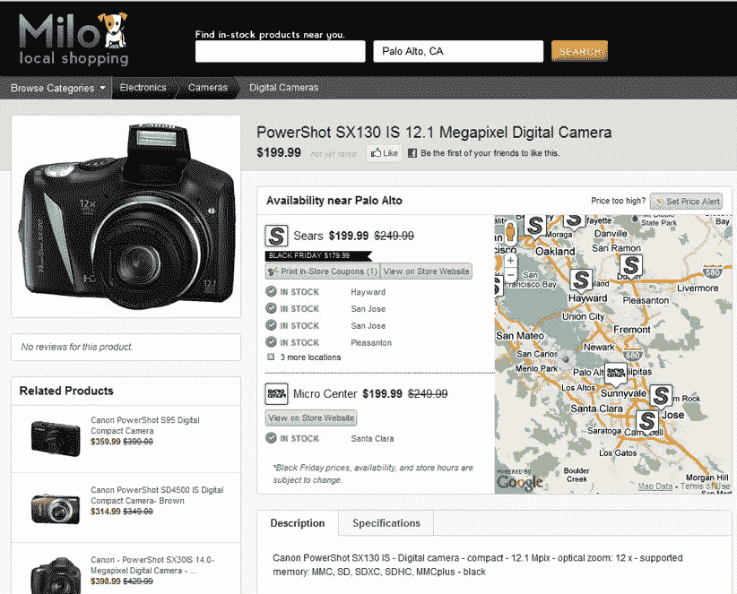

# 使用 Milo 的实时产品库存和交易跟踪器 TechCrunch 在黑色星期五的人群中导航

> 原文：<https://web.archive.org/web/https://techcrunch.com/2010/11/23/navigate-black-friday-crowds-with-milos-real-time-product-inventory-and-deal-tracker/>

# 使用 Milo 的实时产品库存和交易跟踪系统，在黑色星期五的人群中导航

虽然交易很好，但黑色星期五的人群是最糟糕的。你不得不在破晓时分起床，在停车场忍受疯狂，只是为了数量有限的降价商品和其他购物者打架。今天，[米洛](https://web.archive.org/web/20221007035509/http://milo.com/)[给你一个工具](https://web.archive.org/web/20221007035509/http://www.prnewswire.com/news-releases/milocoms-black-friday-guide-lets-shoppers-verify-local-availability-of-sale-products-before-braving-the-crowds-110123584.html)，它可以帮你在去商场或购物中心前检查商品库存，从而避开黑色星期五的拥挤人群。

在指定的[黑色星期五登陆页面](https://web.archive.org/web/20221007035509/http://milo.com/black-friday#ajax=on_sale%3Dall%26has_coupon%3Dall%26merchant_id%3Dall%26category%3Dall%26manufacturer_name%3Dall%26sort%3Dpopularity%26direction%3Ddesc%26minPrice%3D398%26maxPrice%3D269900%26minRating%3D0&availability=&grid=grid%3Dgrid_100)上，Milo 将汇总并跟踪全国商家的黑色星期五
折扣，这样购物者就可以知道特价商品何时售罄以及它们在哪里还有库存。Milo 承诺所有这些库存清单都会实时更新。

Milo.com 黑色星期五页面汇总了 5000 多种产品的销售价格和供货情况，从电子产品和玩具到服装和家居用品。为了访问限时交易并查看产品是否有特价，购物者可以浏览主页或使用位于搜索页面侧边栏的黑色星期五过滤器。

Milo 包括超过 52，000 个全国零售商位置的实时库存信息，它说你也可以使用该公司新发布的 Android 应用程序来访问黑色星期五交易更新。