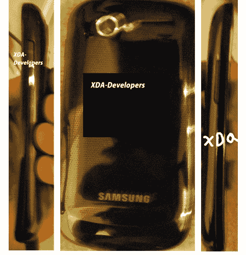

# Nexus S 为 Blurrycam 先生展示其姜饼曲线 TechCrunch

> 原文：<https://web.archive.org/web/https://techcrunch.com/2010/11/25/nexus-s-struts-its-gingerbread-curves-for-mr-blurrycam/>

# Nexus S 为 Blurrycam 先生展示了它的姜饼曲线

谷歌/三星的[泄露的](https://web.archive.org/web/20221006074324/http://search.beta.techcrunch.com/query.php?s=nexus+s)Nexus One 的后续产品——Nexus S——再次出现在一些超级秘密的偷拍照片中，然而这一次，我们有幸近距离观看了它的曲面显示屏。

是的，那些在 [XDA](https://web.archive.org/web/20221006074324/http://www.xda-developers.com/android/xda-exclusive-gingerbread-2-3-nexus-s-pictures/) 的美好的人们已经设法得到了一些即将到来的设备的绝密照片，包括尚未宣布的 Android 姜饼发布。

值得注意的是，他们证实[姜饼](https://web.archive.org/web/20221006074324/http://search.beta.techcrunch.com/query.php?s=gingerbread)确实将是 Android 的 2.3 版本。尽管我们已经很清楚了。

他们的线人也证实了一些规格，引用一下:

*   arm V7 CPU–可能是双核
*   支持打开总帐
*   512 或 328MB 内存(不是 100%已知)
*   1GB 或 2GB 内部内存(不是 100%已知)
*   800×480 屏幕分辨率
*   4 英寸屏幕尺寸
*   超分子 2–可能
*   720P 高清视频

因此，在这里使用“确认”可能是一个慷慨的词——因为此时大多数关键规格都是猜测——但我总是很高兴有信息来搭配漂亮的图片。

在我看来，泄漏的最令人兴奋的部分是那个弯曲身体的视图。我期待看到它本人的样子/感觉。

我们仍在等待谷歌正式宣布姜饼，或 Nexus S，但我们希望这两个宣布一起发生。

XDA 有很多这款设备的照片，包括一些姜饼本身的照片，你一定要去看看。