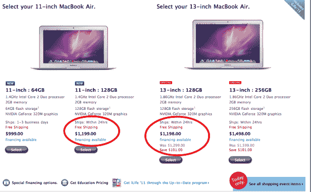

# 11 还是 13？如今，两款 MacBook Airs 的价格相同

> 原文：<https://web.archive.org/web/http://techcrunch.com/2010/11/26/11-or-13-macbook-air/?utm_source=feedburner&utm_medium=feed&utm_campaign=Feed%3A+Techcrunch+(TechCrunch>)

# 11 还是 13？如今，两款 MacBook Airs 的价格相同

在我的推特上反复出现的一个问题是，“11 还是 13？”尽管带有宗教色彩，但这并不是指《圣经》中的段落。这是一个任何痴迷苹果的消费者都熟悉的问题:我应该买 11 英寸的 MacBook Air 还是 13 英寸的？

如果你一直在问自己同样的问题，今天价格差异将不再是决定性因素。虽然最便宜的 11 英寸 MacBook Air 仍然是 999 美元，但 13 英寸机型的黑色星期五[交易](https://web.archive.org/web/20230202220624/http://store.apple.com/us/browse/home/shop_mac/family/macbook_air?mco=MTU3NDU2OTQ)使得配备 128 GB 闪存驱动器的低端机型与配备 128 GB 闪存驱动器的高端 11 英寸机型价格相同。它实际上便宜了 1 美元，1198 美元对 1199 美元，电池续航时间更长。

苹果还有其他的[黑色星期五交易](https://web.archive.org/web/20230202220624/http://www.crunchgear.com/2010/11/26/apples-black-friday-deals-sufficiently-interesting/)，其中大多数都相当微薄，但这一个吸引了我的眼球。MacBook Air 用闪存取代了硬盘，因此在许多任务上比功能更强大的 MacBook Pros 快得多。更多详情可以阅读[名爵的爱评](https://web.archive.org/web/20230202220624/https://techcrunch.com/2010/10/26/13-inch-macbook-air-review/)。

如果你今天正考虑买一台，不买 13 英寸 MacBook Air 的唯一理由是大约半磅的额外重量。