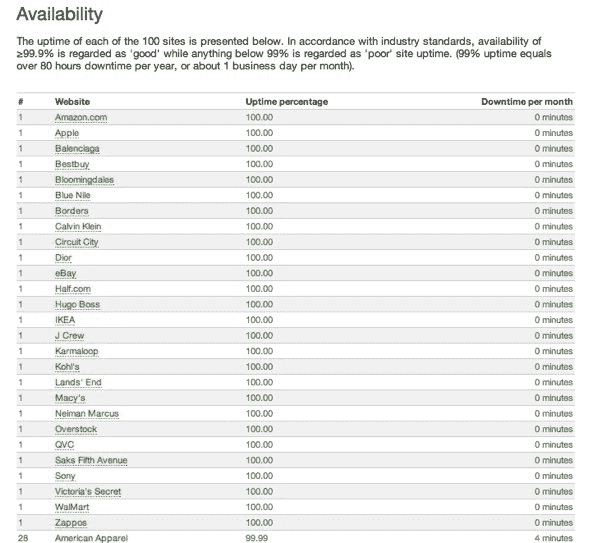

# 随着假日购物者涌向网络，WatchMouse 追踪电子零售商的表现 TechCrunch

> 原文：<https://web.archive.org/web/https://techcrunch.com/2010/11/27/as-holiday-shoppers-flock-to-the-web-watchmouse-tracks-performance-of-e-retailers/>

# 随着假日购物者涌向网络，WatchMouse 跟踪电子零售商的表现

 [网站监控](https://web.archive.org/web/20230218025630/https://techcrunch.com/2010/01/19/watchmouse-api-status/)创业[守望者](https://web.archive.org/web/20230218025630/http://www.watchmouse.com/)现在[监控](https://web.archive.org/web/20230218025630/http://www.watchmouse.com/en/SPI/2010/status_eshops_us.php)前 100 家零售网站在假日购物季的可用性。starup 测试了包括苹果、亚马逊、百思买、Borders、Overstock、沃尔玛和 Zappos 在内的零售网站在 11 月 25 日感恩节和 11 月 26 日黑色星期五之前一个月的可用性和性能。

WatchMouse 说，100 个站点中有 27 个 100%正常运行；15 家公司的得分为 99.99%，只有美国的 Eagle Outfitters、GiltGroupe、Footlocker.com 和 Fry's Electronics 属于“不可接受”一类。American Eagle Outfitters 在 2010 年 10 月 25 日至 11 月 26 日的监控期间表现最差，有近一整天的停机时间。

在感恩节、黑色星期五或两天都遇到性能问题的其他网站包括 Abercrombie 和 Fitch、宝格丽、JC Penney、路易威登、Office Max、Pottery Barn、玩具反斗城、Williams-Sonoma 和 Z Gallerie。

WatchMouse 表示，电子零售商特别容易受到页面加载速度缓慢的影响，因为每个网站都需要加载大量组件来优化其所有产品和图像。但是延迟和性能对于零售网站尤其重要，因为用户会放弃交易。

根据 Forrester Research 和 Akamai 最近发布的一份报告，两秒钟是普通在线购物者加载网页的新阈值。谷歌和微软进行的其他研究表明，仅半秒钟的延迟就会导致购物车放弃率增加，跳出率更高，每次访问的页面更少，以及每个网站访问者的收入减少。

随着本季度消费者预计将在网上花费 324 亿美元，零售商面临着更大的压力，以确保他们的网站在未来几个月的表现。

虽然今年有更多的零售商在黑色星期五提供在线交易，但看看零售网站在网络星期一的表现应该很有趣，这是一年中最繁忙的在线消费日之一。

你可以在这里查看 WatchMouse 的完整列表。

