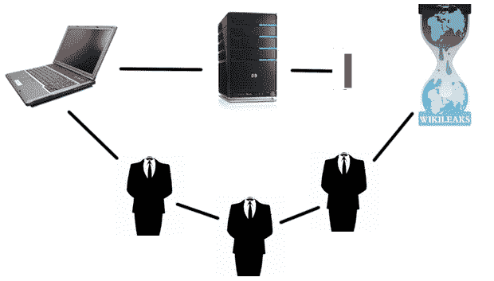

# 彼得·桑德支持替代根域名系统的想法

> 原文：<https://web.archive.org/web/https://techcrunch.com/2010/11/29/peter-sunde-seconds-the-idea-of-an-alternative-root-dns/>

10 月，在 [COICA](https://web.archive.org/web/20230331112900/http://www.govtrack.us/congress/bill.xpd?bill=s111-3804) 法案被推迟后(基本上直到现在)，我提出只要互联网被一个足够集中的 DNS 系统所束缚，可以被美国政府随意掌控，那它实际上就是太集中了。[如果要保持目前互联网上的信息自由水平，目前由 ICANN 主持的传统 DNS](https://web.archive.org/web/20230331112900/http://www.crunchgear.com/2010/10/01/coica-bill-postponed-its-time-to-discuss-alternatives-to-traditional-dns/) 的替代方案似乎是唯一的选择。

我是(现在也是)作为一个门外汉在说话；我对 DNS 的技术细节几乎一无所知，背离该系统的危险和困难数不胜数。但好处是相当可观的，而且开始看起来这是迟早的事。现在，[彼得·桑德](https://web.archive.org/web/20230331112900/http://www.crunchbase.com/person/peter-sunde)，一个更熟悉互联网运作方式的人，[似乎也有类似的观点。](https://web.archive.org/web/20230331112900/http://twitter.com/brokep/status/8779363872935936)

目前，这只是一个请求帮助的请求——空中楼阁。而且我上一篇帖子提出的反对意见肯定还会再次提出:集中式 DNS 对于维护秩序、安全等等至关重要。是的，好吧，只要我们依靠集中的 DNS 来做这些事情，认为它们是必要的是合乎逻辑的。但是那种 A=B，因为 B=A 的逻辑不能令人信服很久。我们依赖它是因为它是我们所依赖的？当我们不再*希望*依赖它时，我们该怎么办？

DNS 的下一步和用户之间的位分配不会像我们已经得到的那样。根本性的变化*将*发生，趋势*将*去中心化。是的，它不会像现在的系统那样安全可靠。我们不得不面对这个问题。根据旧的东西来思考新的东西是很自然的，但这只是在一定程度上。

以前有过这种事情的实验，显然没有一个成功，但这并不意味着不应该再次尝试。毫无疑问，有成百上千的人愿意为这样的事情贡献时间或金钱，也许 Sunde 是这个想法需要的先锋。

一个合理的问题是“这个人在监狱里，而且身无分文，他将如何组织这种努力？”因为事实上，在最近对海盗湾创始人的判决后，Sunde 将服刑八个月。我没有答案给你，但我猜一个最低安全瑞典矫正设施是一个很好的地方做这件事。他们的网速可能比我还快。

如果不出意外的话，建立一个[的备用 DNS 根](https://web.archive.org/web/20230331112900/http://en.wikipedia.org/wiki/Alternative_DNS_root)有足够的权重来保持自己的存在将会推动这个问题。这种事情不是一夜之间就能发生的。但是，世界的 COICAs 紧随信息自由的脚步，没有时间像现在这样开始未来。

**更新**:该项目(目前)被称为 [Dot-p2p](https://web.archive.org/web/20230331112900/http://dot-p2p.org/index.php?title=Main_Page) ，将从建立顶级域名的想法开始，该域名将咨询本地 DNS 数据库，而其他请求将通过。一个明确的目标是:“通过创建一个完全去中心化的. p2p TLD，不依赖于 ICANN 或任何 ISP 的 DNS 服务，并通过让这个应用程序模拟强制加密的 bittorrent 流量，将有一种方法来开始打击基于 DNS 级别的审查，就像美国的新提案以及世界各国(包括中国和伊朗等)使用的那些系统一样。”