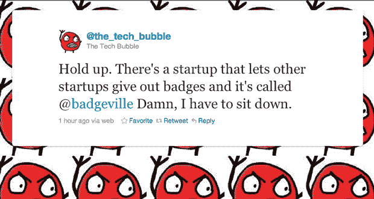
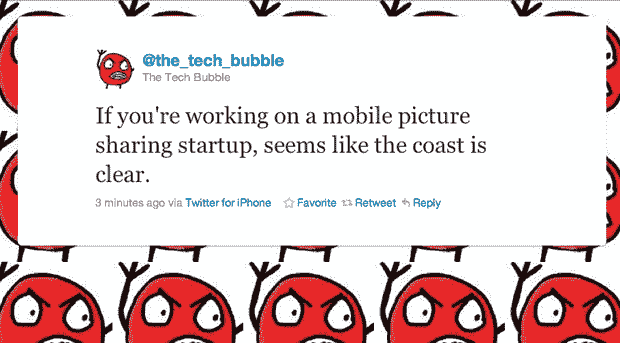

# 科技泡沫现在出现在 Twitter 上 TechCrunch

> 原文：<https://web.archive.org/web/http://techcrunch.com/2010/11/29/tech-bubble-twitter/?utm_source=feedburner&utm_medium=feed&utm_campaign=Feed%3A+Techcrunch+(TechCrunch>&utm_content=Google+International)

# 科技泡沫现在出现在 Twitter 上

虽然我们最近写的每一篇[其他帖子](https://web.archive.org/web/20230203005237/https://techcrunch.com/2010/11/09/arms-race/)似乎都可以被视为硅谷目前正处于*非常*乐观阶段的证据，但在这一篇之前，“T5”脸书现在在二级交易中价值 500 亿美元”几乎拿走了蛋糕。

也许比[传言中的 Groupon 收购](https://web.archive.org/web/20230203005237/http://kara.allthingsd.com/20101129/googles-groupon-offer-5-3-billion-with-700-million-earnout/?mod=tweet)(以及随后的 [Groupon 对 Groupon](https://web.archive.org/web/20230203005237/https://techcrunch.com/2010/11/29/google-groupon-goopon/) 的恶搞)更能标志“美好时光”的转折点，2010 年备受争议的[科技股泡沫现在有了自己的 Twitter 地址](https://web.archive.org/web/20230203005237/http://cdixon.posterous.com/bubble-or-bust-nobody-knows-anything) [@the_tech_bubble](https://web.archive.org/web/20230203005237/http://www.twitter.com/the_tech_bubble) 。从其第一条推文[的时间来看，似乎是迈克的天文脸书估价帖子激发了这个账户。事实上，我不完全相信阿灵顿不是幕后黑手。](https://web.archive.org/web/20230203005237/http://twitter.com/#!/the_tech_bubble/status/9459245955153920)

虽然在早期的 Web 2.0 时代有很多刻薄的博客，包括 [uncov](https://web.archive.org/web/20230203005237/http://www.wired.com/epicenter/2008/01/uncov-calls-it/) 和 [Dead 2.0](https://web.archive.org/web/20230203005237/http://web.archive.org/web/20060829205531/http://www.dead20.com/) ，但我从未见过有自己 Twitter 账户的泡沫。也许账户本身解释得最好，*“我当然有一个 twitter 账户。没有我，Twitter 就不会存在。”*

嗯。我看到你刚才做了什么。

