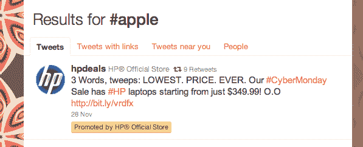
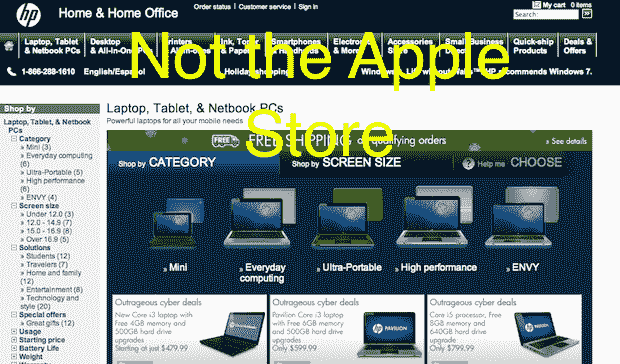

# 苹果收购惠普旧园区，惠普收购# Apple TechCrunch 的 Twitter 广告

> 原文：<https://web.archive.org/web/http://techcrunch.com/2010/11/30/hp-apple-twitter-ad/>

# 苹果买下惠普的旧校园，惠普买下#苹果的 Twitter 广告

上周，[MercuryNews.com 透露](https://web.archive.org/web/20230203033507/http://www.mercurynews.com/ci_16706216?nclick_check=1)苹果公司在他们目前位于加州库比蒂诺的总部附近购买了大量土地。他们实际上买下了旧的惠普园区，这家电子巨头宣布他们要搬出去，以巩固他们在附近帕洛阿尔托的办公室。因此，或许惠普今天收购苹果的一些东西并不令人惊讶:他们在 Twitter 上的标签。

好吧，从技术上来说，苹果对 Twitter 上包含他们名字的标签没有任何权利。事实上，也许惠普的目标是那些在推特上谈论水果的人。是啊，没错。

[正如你在这里看到的](https://web.archive.org/web/20230203033507/http://twitter.com/#!/search/%23apple)，惠普官方商店已经付费向搜索苹果的用户推广带有电脑销售链接的推文。他们有一组他们正在推广的轮流推文，但都指向他们在惠普在线商店的销售——一个看起来与苹果商店没有更多不同的商店。

这种竞争定位在谷歌和其他搜索引擎上一直存在，但在 Twitter 上似乎也越来越成为一种规范。几周前，[我们在 Twitter 上看到了来自微软和谷歌的竞争广告](https://web.archive.org/web/20230203033507/https://techcrunch.com/2010/11/11/google-and-microsoft-take-their-mobile-war-to-the-ad-section-of-twitter/)。

我想知道最近多产的推特用户和苹果高管菲尔·席勒会喜欢他们的苹果吗？

**更新**:正如[史蒂文](https://web.archive.org/web/20230203033507/http://twitter.com/sigwo)在评论中指出的，惠普也为 [#mac](https://web.archive.org/web/20230203033507/http://twitter.com/#!/search/%23mac) 购买了 Twitter 广告。很好。

**更新 2** :正如[凯文](https://web.archive.org/web/20230203033507/http://twitter.com/kevinskocik)在下面指出的，他们还买了 [#macbook](https://web.archive.org/web/20230203033507/http://twitter.com/#!/search/macbook) ！

*【感谢[凯文](https://web.archive.org/web/20230203033507/http://twitter.com/#!/kevinskocik/status/9793286717833216)*