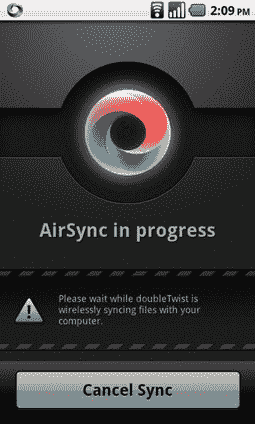
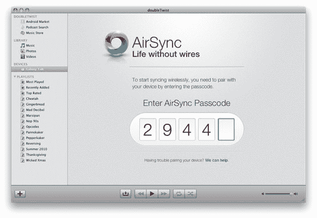

# 未来就在眼前:DoubleTwist 为 Android 带来音乐、照片和视频无线同步技术 TechCrunch

> 原文：<https://web.archive.org/web/https://techcrunch.com/2010/11/30/the-future-is-here-doubletwist-brings-wireless-sync-to-android-for-music-photos-video/>

今天早些时候，Winamp 发布了其 Android 应用程序的[新版本](https://web.archive.org/web/20230202231358/https://techcrunch.com/2010/11/30/winamp-android/)，允许用户将他们的音乐无线同步到他们的 Windows 桌面上(披露:Winamp 和 TechCrunch 都属于 AOL)。这是一个伟大的功能，但在成为“Android 的 iTunes”的竞争中，另一个竞争者可能已经快要超过 Winamp 了。

我们[已经追踪](https://web.archive.org/web/20230202231358/https://techcrunch.com/tag/doubletwist/) [DoubleTwist](https://web.archive.org/web/20230202231358/http://www.doubletwist.com/) 及其与 Android 的密切关系一年多了。该公司提供了一款桌面媒体播放器，看起来很像 iTunes(鉴于“iTunes for Android”的主题，这不是偶然的)，它还增加了对 Android 应用商店的支持，通过亚马逊 MP3 的 API 提供了一个音乐商店，以及一个播客目录。今天，它推出了可能是迄今为止最酷的功能:无线同步，他们恰如其分地称之为“空中同步”。这不仅仅是为了音乐——DoubleTwist 可以让你无线同步你的电影、音乐和照片。

考虑到该特性的强大，安装相对来说并不费力。为您的 Mac 或 PC 安装最新的 DoubleTwist 客户端，然后下载新版本的 Android 应用程序。将你的手机设置为与你的电脑连接到同一个 Wifi 网络，启动 Android 应用程序，点击新的“空中同步”按钮。桌面应用程序将检测你的手机，要求你输入密码(这类似于蓝牙配对过程)，然后你可以配置应用程序同步音乐、照片和视频(照片同步目前仅在 Windows 上可用，但很快将用于 Mac 版本)。

总的来说，这个过程需要大约三分钟，尽管同步本身需要更长的时间，可能需要几个小时，这取决于你的 Wifi 速度。不过有一点需要注意:DoubleTwist 的 Android 应用程序一直是免费的；基本功能仍然如此，但如果你想要 AirSync，你必须升级到付费版本——前 10，000 名用户的升级价格为 99 美分，然后其他人的价格将跃升至 4.99 美元。

AirSync 最酷的地方是在初始设置后，一切都应该自动工作。每当你走到无线网络的范围内，DoubleTwist(桌面客户端)就会检测到手机上的任何新内容，并将其同步回电脑；您还可以将新内容从电脑同步回设备。这意味着你可以出去用手机拍摄一些视频，而且，如果你回家后没有立即走到电脑前，当你坐在办公桌前时，它们应该已经在等着你了(好吧，这也是假设你开着电脑)。

印象相当深刻。不幸的是，似乎有一些问题——我的手机在一次同步过程中变得非常迟钝——但我怀疑 DoubleTwist 会在接下来的几周内解决大部分问题。

总之，这就是未来。无论 DoubleTwist 或 Winamp 或谷歌的官方解决方案成为标准，一个没有恼人的网络共享的世界显然是事情的发展方向。DoubleTwist 是第一个提供如此深度集成的软件，绝对值得一试。

考虑到发布时间(最初定于昨天，但为了测试新版本而推迟到今天)，我联系了 DoubleTwist，看看他们对 Winamp 的发布有什么看法。除了指出一些功能差异(Winamp 不支持 MAC，目前只支持音乐)，他们还想说——他们不是在装腔作势:

> 总的来说，我们不认为 Winamp 是一个竞争对手，因为他们面向一个特定的子类别用户，这些用户不介意无尽的菜单、偏好和选项。我们更关注大众市场，普通用户只想充分利用他们的设备，而不会被技术淹没。

