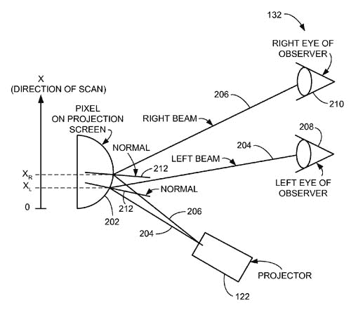

# 苹果为极其复杂的 3D 显示方法授予专利 TechCrunch

> 原文：<https://web.archive.org/web/https://techcrunch.com/2010/12/01/apple-granted-patent-for-insanely-complicated-3d-display-method/>

# 苹果为极其复杂的 3D 显示方法授予专利

本周早些时候，苹果公司获得了一系列专利，尽管这些专利很实用，甚至内容平淡无奇，[的新专利](https://web.archive.org/web/20230202220459/http://patft.uspto.gov/netacgi/nph-Parser?Sect1=PTO2&Sect2=HITOFF&p=1&u=%2Fnetahtml%2FPTO%2Fsearch-bool.html&r=1&f=G&l=50&co1=AND&d=PTXT&s1=7,843,449.PN.&OS=PN/7,843,449&RS=PN/7,843,449)简直令人费解。我在想，那家公司的许多天才工程师想出的点子比苹果实际能执行的还要多，但他们太酷了，不能忽视。

今天的“grab bag”专利是一种[自动立体 3D 显示器](https://web.archive.org/web/20230202220459/http://www.crunchgear.com/2010/06/19/a-guide-to-3d-display-technology-its-principles-methods-and-dangers/)，它可以跟踪用户在空间中的位置，并相应地调整显示器。这是一种异常复杂的做事方式，但如果你不想戴眼镜，这就是你得到的。

这项发明包括一个 [Kinect](https://web.archive.org/web/20230202220459/http://www.crunchgear.com/tag/kinect/) 风格的运动和位置传感器，它可以确定用户的位置——特别是他眼睛的位置。显示表面将是由“角度响应反射表面功能”控制的“可编程反射镜”正如你所知，这是一项技术专利，尽管我对运动和眼睛检测的精度有所怀疑，但如果这样的显示表面存在，原理似乎是合理的。

我的问题实际上更像是“为什么是苹果？”我的意思是，我很难想到这项技术的应用，尽管它很有趣，但在未来几年的任何可以想象的消费技术中。当然，Kinect 展示了一些类似的高级功能，3D 内容只会增加和改善，但这个系统非常复杂，而且相当昂贵。

这种设备在一些情况下似乎很实用——允许自由移动固然很好，但当然你必须保持两只眼睛都盯着显示器，并且协调不同的观众以便在空间中进行互动将是非常棘手的。

无论如何，对下一代显示器的认真思考是件好事。3D 电视[没有把任何人吹走](https://web.archive.org/web/20230202220459/https://techcrunch.com/2010/12/01/tv-sales-slow-2010-stat/)，因为几乎没有引人注目的 3D 内容，眼镜也很烦人。没人知道下一步会是什么，但伪全息眼球追踪显示器是一个不错的猜测。

[通过[登记处](https://web.archive.org/web/20230202220459/http://www.theregister.co.uk/2010/12/01/apple_3d_patent/)