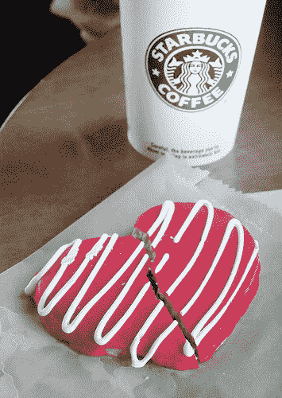

# Groupon 刚刚拒绝了谷歌的 60 亿美元，转而支持 IPO 了吗？TechCrunch

> 原文：<https://web.archive.org/web/http://techcrunch.com/2010/12/03/did-groupon-just-spurn-googles-6-billion-in-favor-of-an-ipo/>

# Groupon 刚刚拒绝了谷歌的 60 亿美元，转而支持 IPO 了吗？

   图片 2008 [大卫·戈林](https://web.archive.org/web/20230202220812/http://www.flickr.com/people/15923063@N00 "click to visit the Flickr profile page for David Goehring") | [更多信息](https://web.archive.org/web/20230202220812/http://www.flickr.com/photos/15923063@N00/2250205453 "get more information about the photo 'A Cookie Crumbles'")**(via:[Wylio](https://web.archive.org/web/20230202220812/http://wylio.com/ "free pictures"))**芝加哥突发商业新闻[报道](https://web.archive.org/web/20230202220812/http://chicagobreakingbusiness.com/2010/12/sources-groupon-rejects-googles-offer-will-stay-independent.html)Groupon 在广泛报道的交易谈判中拒绝了谷歌提出的 50-60 亿美元的报价。报道援引两个消息来源称，交易没有通过，该公司仍可能选择在 2011 年上市。

如果这些报道是真的，那么这将是谷歌第二次未能进入本地市场，Yelp 谈判也失败了。从这么多钱中抽身而出是非常不可思议的。然而，情况很可能仍然不稳定，这些公司可能会继续调情，直到 Groupon 上市或从投资者那里获得更多资金。

这是一次漏洞百出的谈判，基本上是[通过媒体](https://web.archive.org/web/20230202220812/http://kara.allthingsd.com/20101203/exclusive-groupon-annual-revenues-actually-2-billion/)进行谈判，所以这可能只是 Groupon 通过战略漏洞来玩硬球的方式。你的移动谷歌。

**更新:**我们从[第三个消息来源获悉，该交易实际上已经取消](https://web.archive.org/web/20230202220812/https://techcrunch.com/2010/12/03/confirmed-the-groupongoogle-deal-is-off/)，Groupon 的收入[运行率](https://web.archive.org/web/20230202220812/http://www.investopedia.com/terms/r/runrate.asp)现在是 20 亿美元，而不是经常被引用的 5 亿美元。