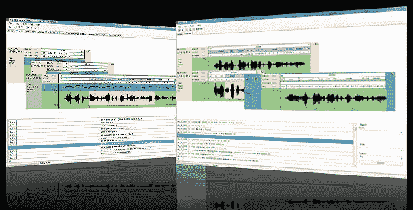

# 谷歌收购语音艺术，让机器人声音听起来像人类

> 原文：<https://web.archive.org/web/https://techcrunch.com/2010/12/03/google-acquires-phonetic-arts/>

# 谷歌收购语音艺术，让机器人声音听起来像人类

不，谷歌还没有收购 Groupon(还没有)。但是它确实有一个更小的，但非常有趣的收购要宣布:它只是[收购了](https://web.archive.org/web/20221206190431/http://googleblog.blogspot.com/2010/12/can-we-talk-better-speech-technology.html) [语音艺术](https://web.archive.org/web/20221206190431/http://phonetic-arts.com/index.html)，一家总部在英国的公司，致力于游戏中的语音合成。

phonical Arts 开发了一种技术，可以将几行录音对话转换成“语音库”——用你的声音向它输入几百行录音，然后它可以将这些声音拼凑起来，生成听起来令人惊讶地真实的新句子。到目前为止，语音艺术主要集中在将这项技术用于游戏，但谷歌打算更广泛地使用这项技术，使其自动语音听起来更加流畅和人性化。

如果你没有注意到，谷歌在过去几年里一直非常关注其语音识别和转录技术(他们已经研究了很长时间，但现在这项技术正在将其转化为产品)。YouTube 现在包括数百万个视频的自动配音字幕；Android 在整个操作系统中集成了语音识别功能；谷歌还为 iPhone 等其他移动平台开发了语音搜索应用。

但是，尽管这些语音识别应用程序变得越来越好，但每当它们需要向你读一些东西时(例如，语言翻译或 GPS 导航)，很明显你在听电脑说话。这也是谷歌计划开始应用语音艺术技术的地方。

同样值得指出的是:在其官方博客中，谷歌特别提到了伦敦日益发展的科技产业:

> 英国现在特别关注技术和创新，我们很高兴通过此次收购加深我们在该国的投资。我们在伦敦已经有一个强大的工程中心，并期待着欢迎语音艺术团队。我们对他们的技术感到兴奋，虽然我们还没有分享的计划，但我们有信心一起朝着星际迷航的未来更快地前进。