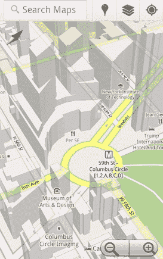
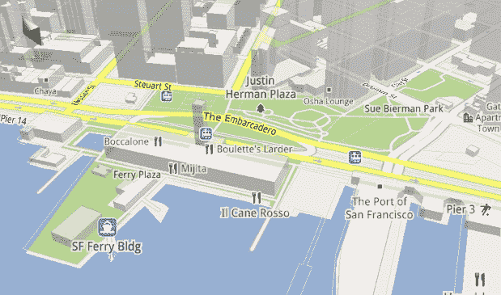

# Android 地图应用将获得 3D 建筑、指南针方向和离线功能 TechCrunch

> 原文：<https://web.archive.org/web/http://techcrunch.com/2010/12/06/android-map-app-3d-compass-offline/>

# Android 地图应用程序将获得 3D 建筑、指南针方向和离线功能

Android 手机上的谷歌地图应用将很快获得重大升级，这将使它能够更快地渲染地图图像，整合 3D 建筑，提供离线缓存，并使用指南针来定位地图。今晚在 T4 举行的 T3 D 移动会议上，Android 首席执行官安迪·鲁宾展示了新应用的预览版。

新应用的核心是一个动态地图渲染引擎，它可以在你使用地图时绘制地图，并在放大和缩小不同级别时提供更平滑的过渡。动态渲染还可以在放大街道视图时开始显示 3D 建筑。触摸屏将允许你倾斜和旋转地图和建筑物。

新地图加载速度更快，因为它们需要的数据少了 100 倍。这款应用不是为每个关卡下载完整的地图图像，而是下载描述所有不同关卡的完整地图的元数据，然后动态渲染相应的区域。这将开始在手机上赋予谷歌地图离线功能。也许可以在手机上缓存整个城市的地图。对于使用谷歌地图逐路段导航的人来说，当新的应用程序推出时，即使没有数据连接，它也可以重新计算路线。

谷歌地图应用程序还将使用 Android 手机上的内置指南针，自动将地图的方向翻转给手持手机的人。当你从一个不熟悉的地铁站出来，或者走出一栋大楼时，这个定位功能将会派上用场。

