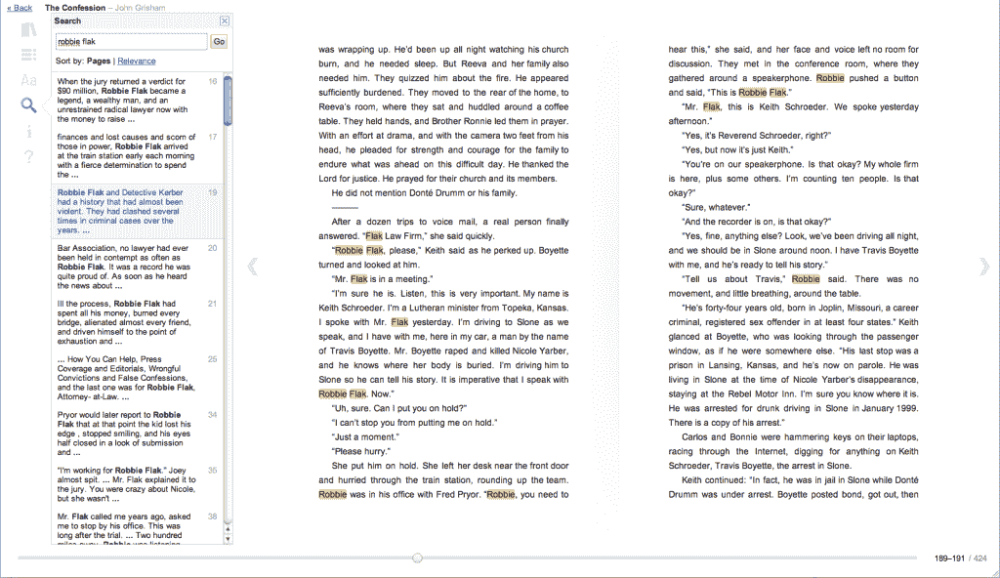
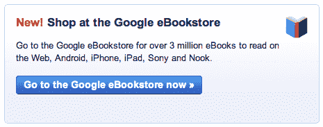
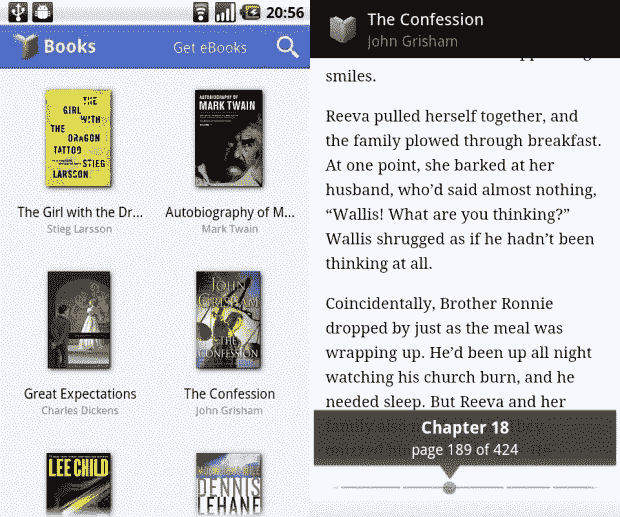

# 谷歌电子书:电子阅读走向云端 TechCrunch

> 原文：<https://web.archive.org/web/https://techcrunch.com/2010/12/06/google-ebooks-e-reading-takes-to-the-cloud/>

谷歌今天发布了传闻已久的进入[电子书](https://web.archive.org/web/20230210045023/http://www.crunchgear.com/tag/e-readers/)销售世界的消息，并不像之前猜测的那样叫做谷歌版，而是一个听起来更匿名的[谷歌电子书](https://web.archive.org/web/20230210045023/http://books.google.com/ebooks)。基本想法是提供一个完全基于网络的电子书平台，可以从任何带有浏览器的设备上访问。他们选择的商业模式没有竞争对手那么集中，但不完全是我上周设想的[分布式卖家网络。](https://web.archive.org/web/20230210045023/https://techcrunch.com/2010/12/01/google-editions-divide-and-conquer/)

我收集的关于电子书商店模式去中心化的羊毛都在那篇文章里，所以我们现在只关注电子书服务的细节。

一个小提示:我将继续使用“电子书”这个术语，尽管该服务已经选择去掉连字符。像许多新的科技相关短语一样，这个词和它的相关词还没有形成一个统一的标准形式。

电子书服务可以在任何兼容 Webkit 的浏览器中运行。阅读器本身内置于 Javascript 中，可以通过浏览器或独立应用程序在移动设备上访问 Android 应用程序现在应该可以使用，iOS 应用程序也将很快推出。

它们的推出得到了大约 4000 或 35000 个出版商合作伙伴的支持，这取决于你如何计算。4000 是美国发布的数字，但在国际上，他们正在与该数字的剩余部分，预计 2010 年 1Q 发布。所有主要出版商都已签约，将提供总计约 30 万本版权作品，很可能包括你在任何其他书店都能买到的任何新书。

他们也很自豪能与大学、学术、教科书和专业出版商合作，他们的作品很难得到。他们已经与美国书商协会、鲍威尔书店和 Alibris 达成了协议。作为一种捷径，我问是否有任何主要的协会或出版商谷歌没有包括在至少一个基本的合作伙伴关系中，他们说没有。当然还有庞大的公共领域作品图书馆，目前超过 250 万本，这使谷歌电子书总数增加到大约 300 万本。

GoodReads 是他们第一个(也是唯一一个)合作伙伴；电子书服务将与社交阅读网站捆绑在一起，收入将分成三份。在这个问题上，收入分割方案分为几类。主要出版商将收取标价的 70%,其他出版商将收取 52%,谷歌与之谈判的许多独立书店和出版商都有自己未公开的价格。

我很惊讶谷歌攫取了这么多的标价；对于一家从大批量、低价值交易中获利数十亿的公司来说，选择每笔销售额的一半令人费解。我猜想他们会玩一个十年的游戏，赌电子书会成为一个高容量的市场，以至于谷歌只能承担每笔交易的 25%甚至更少，鼓励人们在竞争中使用他们的服务。但是我知道什么？

至于我之前描绘的自助出版乌托邦，那还不太可能。我有一种幕后谷歌商店的愿景，只在一个可嵌入的购买小部件中可见。他们说他们正在研究类似的东西，但是为了发布，购买将在电子书网站上进行。

如你所料，阅读器本身是一件简单的事情，就像通常的谷歌风格一样。这两个平台在分辨率和风格上有一些差异，但它们在很大程度上是相似的。你有你的“书架”视图，大概是你开始的地方，在那里你可以搜索你的书或所有的电子书。然后你就有了你的阅读视图，有一个很好的搜索/高亮功能和所有常用的定制选项。你在每本书中的位置(如果有这个功能的话，可能还有你添加的任何笔记或书签)会在设备之间同步，你可以在手机上从电脑上停止的地方继续。

该团队对他们使用的页码编排方案感到特别自豪，该方案显示的不是“虚拟”页码，它会在每次调整文本大小时发生变化，而是该版本的实际打印页码。如果你把文本设置得很小，它会显示“第 150-155 页”之类的内容。虽然打印页码的相关性正在下降，但这是一个不错的折衷。该团队还指出，阅读器界面已经通过内部测试经历了四个完整版本，所以它不会像一些谷歌产品发布时那样原始(我觉得他们是在暗示)。很高兴知道。

对于需要数字版权管理的电子书，谷歌使用的是 ACS4，尽管这只是为了在使用该格式的设备上存储和显示书籍。从谷歌购买的版权书籍将能够在兼容 ACS4 的设备上阅读，据我所知，不幸的是，这一类别不包括 Kindle ~~或 Nook~~ (Nook works，我的错误)。

一旦我们有一点时间来评估他们，我们将跟进这篇文章，提供我们对这项服务、阅读器应用程序等的印象。当然，如果你在美国，你也可以免费查看，并在评论中分享你的印象。

* * *

