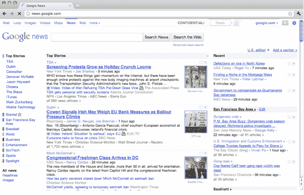
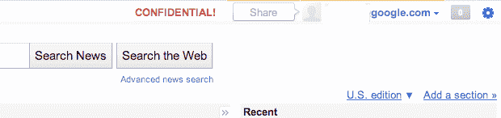

# 机密！看起来“Google +1”只是被意外泄露了(图片)

> 原文：<https://web.archive.org/web/https://techcrunch.com/2010/12/07/google-plus-one-pic/>

# 机密！貌似“Google +1”只是不小心泄露了(Pic)

虽然我们还没有 100%证实它(*更新:我们已经通过一个消息来源*证实了)，但你在上面看到的是我们非常相信是谷歌最新社交活动的照片。没错，就是以前叫“Google Me”、后来叫“[翡翠海](https://web.archive.org/web/20221220131648/https://techcrunch.com/2010/12/01/google-social-emerald-sea/)，现在叫“ [Google +1](https://web.archive.org/web/20221220131648/https://techcrunch.com/2010/12/02/google-plus-one-brin/) 的艺人。

如你所见，这是一个工具栏，位于谷歌属性的顶部——在这里是谷歌新闻。有一个分享按钮，一个谷歌账户图标的位置，和一个谷歌用户名。旁边是一个数字计数——目前还不清楚这是干什么用的。(也许一股算？)旁边是一个选项菜单。

还要注意大红色的“机密！”标签。是的，分享这个的人显然不应该。

另一个需要注意的重要事情是:左侧工具栏链接中的“循环”区域。这与我们到目前为止报道的关于 Google +1 的[完全一致——即它的一个关键部分是基于“循环”，这似乎是 Google 对“组”的说法。我们听说测试中的一个 iPhone 应用程序也是这么叫的。](https://web.archive.org/web/20221220131648/https://techcrunch.com/2010/12/04/google-plus-one-iphone-facebook-loop/)

最后，记得几周前我们报道过一个新的谷歌工具栏区域正在测试。这似乎是为了给明年年初推出的 Google +1 腾出空间。

下面，找到一些该地区更清晰的图片。

我们已经联系谷歌对这张图片发表评论，但还没有得到回复。如果有，我们会及时更新。

**从谷歌更新**(真快！):

> “我们一直在尝试新的方法来改进我们的产品，我们已经确认我们专注于在整个谷歌中融入社交元素。但目前我们没有新的消息要宣布。”

