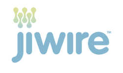

# “Groupon Everywhere”项目继续推进超本地交易(通过 JiWire)

> 原文：<https://web.archive.org/web/http://techcrunch.com/2010/12/07/groupon-everywhere-jiwire/?utm_source=feedburner&utm_medium=feed&utm_campaign=Feed%3A+Techcrunch+(TechCrunch>)

# “Groupon 无处不在”项目继续推进超本地交易(通过 JiWire)

Groupon 几乎没有停顿就拒绝了谷歌 60 亿美元的报价，然后继续向在线本地广告巨头迈进。上周，它[推出了自助团购网站](https://web.archive.org/web/20230203102123/https://techcrunch.com/2010/12/01/groupon/)，并与[雅虎](https://web.archive.org/web/20230203102123/http://eu.beta.techcrunch.com/2010/10/29/yahoo-starts-embedding-groupon-code-in-global-distribution-deal/)、[易贝](https://web.archive.org/web/20230203102123/https://techcrunch.com/2010/10/25/groupon-ebay/)、[宁](https://web.archive.org/web/20230203102123/https://techcrunch.com/2010/10/21/ning-gets-its-groupon-on/)和报纸网站建立了[分销合作关系。我们了解到，Groupon 最新的分销协议是与 WiFi 和移动广告网络 JiWire 达成的，这是内部称为“Groupon Everywhere”的战略的一部分。](https://web.archive.org/web/20230203102123/https://techcrunch.com/2010/10/16/getting-to-the-bottom-of-the-crazy-yahoo-groupon-rumors/)

有了 JiWire，Groupon 将能够提供超地方级别的交易——不仅仅是按城市，而是按社区。JiWire 经营着一家主要在公共 WiFi 网络上运行的移动广告网络。通过与 40 多个公共 WiFi 网络和 60 个机场的合作，其广告每月覆盖超过 3000 万人，JiWire 知道他们是在咖啡馆还是在航站楼，因此可以根据他们的位置量身定制优惠。使用 Groupon 的 API，JiWire 可以筛选其广告网络上任何给定设备附近的交易，并根据用户的位置和时间提供有针对性的报价。JiWire Groupon 交易还将与提供返回 JiWire 位置的移动应用程序配合使用。(JiWire 最近[收购了](https://web.archive.org/web/20230203102123/https://techcrunch.com/2010/11/23/jiwirenearbynow/)移动购物平台 NearbyNow)。

正如我几天前指出的那样，Groupon 的每日交易实际上是一种基于表现的本地广告的新形式，它正试图通过尽快扩大此类交易的库存来巩固其在这个新兴市场的领先地位。今年夏天，它开始走这条路，推出了[个性化交易](https://web.archive.org/web/20230203102123/https://techcrunch.com/2010/07/28/groupon-custom-deals/)，这使它能够在任何一个城市每天进行多项交易。(例如，在旧金山，Groupon 目前有 8 笔交易)。自助商店也应该扩大其库存中的交易数量，这些不同的分销合作伙伴也是如此。

所有这些只是 Groupon 现有的和不断扩大的库存的另一种分配方式。预计未来会有更多的分销交易。这些交易削减了 Groupon 健康的 50%的利润，因为它现在必须与新的合作伙伴分享它的优惠券美元，但它的交易被更多的人看到。自助式 Groupon 商店也将削减利润，Groupon 只能获得这些交易的 10%。

Groupon 需要比竞争对手领先十步，而“Groupon Everywhere”正是它希望做到的。Groupon 接下来会走向何方？手机应用签到似乎是一个显而易见的地方。地理定位服务已经是 Foursquare 和其他地理定位应用的一部分。如果你在某个地方登记，而那家商店或附近的一家正在提供 Groupon，那可能是展示 Groupon 优惠的好时机。竞争对手 BuyWithMe 已经在[测试与 SVNGR 类似的概念。虽然目前还没有入住交易，但 Groupon 正在研究这件事。](https://web.archive.org/web/20230203102123/https://techcrunch.com/2010/09/21/buywithme-scvngr/)