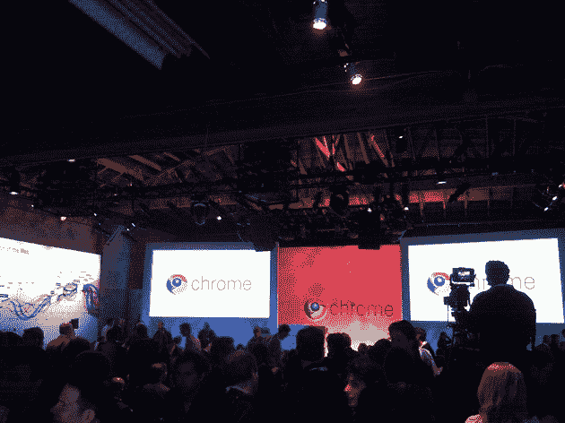
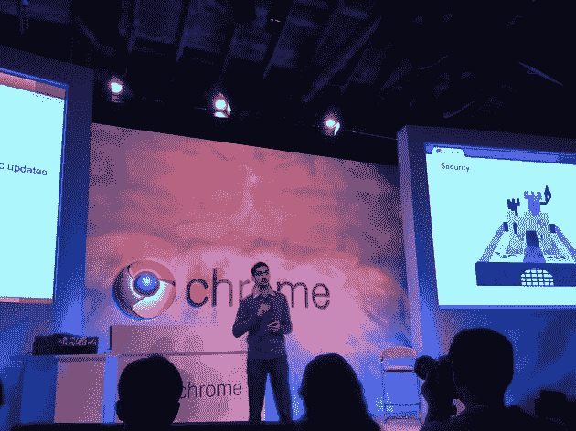
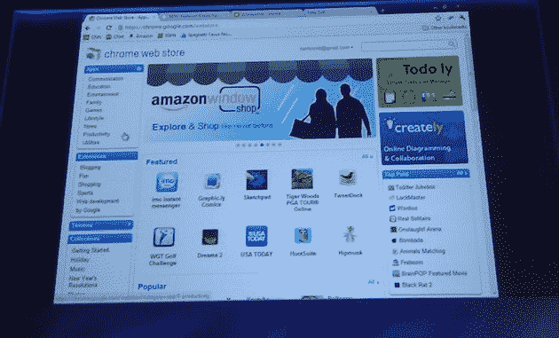
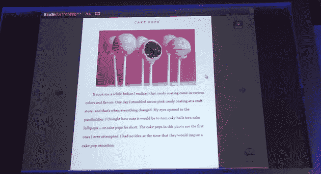
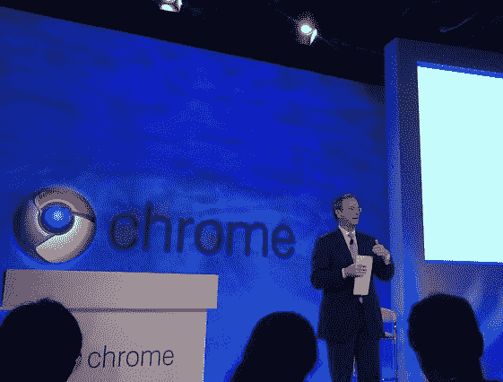

# 来自谷歌 Chrome 活动的现场直播:Chrome 操作系统、网络商店等 TechCrunch

> 原文：<https://web.archive.org/web/http://techcrunch.com/2010/12/07/live-from-googles-chrome-event-chrome-os-web-store-and-more/>

终于来了。在宣布近一年半之后，今天，人们普遍预计谷歌将推出 Chrome OS，这是一款超快、轻量级的操作系统，完全基于其广受欢迎的 Chrome 网络浏览器。我们还看到谷歌推出了基于网络的应用市场 Chrome 网络商店。

自从 Chrome OS 首次发布以来，我们一直在跟踪它的发展(这是一个开源项目，所以很难保密)，但仍然有很多问题:它将配备什么硬件？价位是多少？或许最重要的是:它真的会提供一系列网络应用，使之成为 Windows 和 Mac OS X 等传统操作系统的可行替代品吗？网上商店本身也带来了许多问题。请继续阅读，寻找答案。还有一个[直播](https://web.archive.org/web/20230203013844/http://www.youtube.com/googlechrome)。

产品管理副总裁桑德尔·皮帅上台。
三个领域:Chrome、Chrome 网络商店和 Chrome 操作系统。

Chrome 的发展非常迅速。上一次，它在六个月前报告了 Chrome 的 7000 万活跃用户。这些是日常使用它的主要用户(谷歌在衡量这一点的方式上很保守)。现在它拥有**1.2 亿**用户。

原因一:Chrome 很快。

布莱恩·拉考斯基上台了。展示 Google instant 烘焙到 omnibar 中——键入一个字母，它会转到你最常访问的以该字母开头的页面(看起来相当光滑)。还展示了嵌入 Chrome 的 PDF 阅读器。现在他正在展示 WebGL 的 3D 功能。3D 鱼演示，一个漂亮的身体浏览器…“这一切真的真的很快”。

皮查伊重返舞台。

两年前 Chrome 首次发布时，其新的 javascript 引擎 V8 比现有最快的引擎快 8 倍。而且比 IE 快 16 倍。我们一直在不断改进，今天我们宣布了一项名为曲轴的改进。根据基准测试，这使得引擎比现在快了 2 倍。它比两年前最快的网络浏览器快 50 倍，比两年前的 IE 快 100 倍。

**Chrome 网络商店**
在当前的网络应用情况下，开发者很难受到关注并从中获利。用户不愿为一个小开发商的网络应用支付几美元。

展示网络商店界面。看起来很像 iTunes 应用商店(这很有意义——他们给用户提供他们习惯的东西)。

炫耀 NPR app，体育画报，现在又是游戏。展示梦想 2。它的价格是 1.99 美元，你点击“购买并安装”，输入谷歌证书。大约需要 5-10 秒，您就完成了安装。然后以. crx 文件的形式下载。

开发者在支付方面有一定的灵活性。可以让人‘免费试用’。

NYT 首席技术官正在演示他们的应用程序。让您使用右侧的边栏浏览文章。使用 HTML5 和其他现代网络技术。

现在 EA 正在舞台上展示 Poppit——他们在这里对游戏给予了很多关注，正如我们所期待的。快速全高清显卡。Poppit 将被嵌入到新的 Chrome 9 版本中(是的，说真的)。

亚马逊橱窗。长得很多(一模一样？)到几周前发布的亚马逊 Windowshop 的 iPad 原生应用程序。我为各种平台——从 Android 到 iOS——开发了一系列应用程序。今天宣布 Kindle for the Web(有趣的是，他们在谷歌的活动上这么做，因为谷歌刚刚推出了自己的竞争电子书平台)。书籍以网格的形式排列，有一种类似 Coverflow 的方式来浏览你的书籍。任何人都可以把这些加到一个网站上，“让自己的网站成为自己的书店”。明年初推出网络版 Kindle。

chrome.google.com/webstore 的 T4 是网上商店的网址。今天上线。在接下来的几个月里，它将在 Chrome 浏览器中占据显著位置。

Chrome OS:
你打开它，你选择你的互联网连接。您阅读并接受条款和条件。然后你检查更新，登录你的机器(你不必登录)。接下来，你给自己拍一张照片(还是那句话，没必要)。然后你就大功告成了——在全新的 Chrome 笔记本里，你的扩展，应用程序等等。0-60 秒，在全新的机器上完成。一旦你进入……看起来就像 Chrome(这并不奇怪)。

展示关闭笔记本电脑并将其置于待机状态后“恢复”所需的时间。待机状态下可持续数天。打开它，它就起来了。延迟因素是让用户移动他们的手并在键盘上打字(也就是说，它非常非常快)。

显示出变化几乎立即在机器间传播。不管你用哪种设备。“处处相同的体验”。

此外，人们共用电脑也很常见。今天很难共享计算机，尤其是与朋友共享。犹豫是因为人们担心看到对方的浏览器历史。所以就有了访客模式(顺便说一下，其他操作系统也有)。它开启了一个完全隐姓埋名的模式。他们使用设备，他们所做的一切都是隐私的，数据会被清除。好友让好友登录功能”。

离线模式呢？可以继续在谷歌文档中处理文档。下次他获得连接时，他的更改和其他用户的更改会被同步。Docs 团队正在研究这个，这是 Google Docs 即将推出的功能(听起来好像还没有完成)。许多应用程序将能够使用 HTML5 离线工作。

我们意识到在今天的现代网络中，你需要保持联系。实时更新，社交网络，不断的邮件。当你没有联网的时候，电脑就没那么有用了。“用户始终可以选择保持联系”。启用蜂窝连接。

每台 Chrome 上网本都将内置数据连接。可以在 Wifi 和蜂窝之间切换。

可以使用谷歌云打印进行打印。在连接到网络的任何设备上打印。云打印处于测试阶段，很快就会推出。

**Chrome 操作系统如何连接** :
与威瑞森合作。2 年内每月 100 MB 免费数据。没有合同，只为你需要的东西付费。9.99 美元起的计划。没有激活，超龄或取消费用。自动激活。

一日通票是 9.99 美元，当天你可以获得无限量的数据。也可以大块买。

**安全**
自动更新。三博星。所有数据都是加密的。和验证的引导。

戈登佩恩 SVP 思杰系统在舞台上。在工作场所谈论 Chrome OS。显示 Citrix 接收器。无论您是在公司内部还是远程，都可以登录并获得您的应用程序。显示 Excel —单击它，它会打开 Excel。看起来像本地人。“我们在 Chrome 中访问 Excel，但它运行在数据中心的服务器上，即公司的私有云上。所以它是安全的，在数据中心运行。很快(比在 PC 上启动还快)。”预计在明年上半年推出。

**总结**

“我们还没有完全完成。”这些设备有 USB 支持，所以人们可以插入相机(听起来他们需要完成驱动程序)。有虫子。所以我们意识到我们还有一些时间。

宏碁和三星 Chrome 笔记本将于 2011 年年中在全球上市，其他 OEM 厂商将紧随其后。

对于那些习惯使用测试版软件的早期用户来说，谷歌正在启动一个试点项目。Cr-48。12.1 英寸显示屏，全尺寸键盘，触摸板，全球模式 3g。Wifi，8+小时活跃使用，8+天待机。用于视频聊天的网络摄像头。

“没有大写锁定，没有功能键，没有高清，内置越狱模式-你可以做任何你想做的事情”

这是试点计划的全部细节。

谷歌首席执行官埃里克·施密特(Eric Schmidt)走上讲台，谈论云计算的梦想。这些概念中有许多非常古老，但直到现在它们才真正能够开花结果。我不想进入操作系统和浏览器行业。谢尔盖和拉里秘密雇佣了一些聪明人来帮助火狐，他们最终做出了 Chrome。它突破了人们在安全性、速度方面的架构框架。

我们已经从可靠的磁盘和不可靠的磁盘进入了一个拥有可靠网络和您并不真正需要的磁盘的世界。

定价问答？
合作伙伴将举办他们自己的发布活动，因此没有什么可分享的..(蹩脚)。

谷歌将如何把 Chrome 操作系统推向市场？目标是做试点项目，获得反馈，并据此制定计划(有点回避问题)。

Chrome 网络商店会出现在其他浏览器上吗？最初它需要 Chrome 中的一些东西。但是底层应用是标准的基于网络的应用。网上的 Kindle 应用程序只能在浏览器中运行。Chrome 网上商店负责支付和安装，但这些应用程序也可以在其他浏览器上运行。

Cr-48 内置 3G 和威瑞森。Chrome 网络商店无法在 Android 上运行。

原生客户端？这是我们战略的重要组成部分。许多应用程序都存在于 C，C++代码中..Native Client 解决了这两个问题，让您可以在浏览器中运行 C++代码。它目前可供开发者使用，正在测试中。并非稳定渠道中的所有用户都支持。这将在明年初实现。

随着人们采用 Chrome，我们看到了直接收入。其他新兴的修订机会。企业感兴趣，可以为企业提供 Chrome 操作系统。

《曲轴制造》今天将在金丝雀频道播出。

我们专注于电脑和笔记本电脑，但也会扩展到更小和更大的屏幕。

你用你的 Google 帐户登录，但是允许其他人使用，比如 Open ID，OAuth 等等。也可以使用来宾模式。没有任何东西将 Chrome 或 Chrome OS 与谷歌联系在一起。使用 Chrome 或 Chrome OS 不需要谷歌账户。

现在，如果你把东西插入 USB，什么都不会发生。我们已经支持键盘和鼠标了。我们将支持存储和其他。对于打印机，我们支持云打印，我们认为这是一个更好的模式。当然是在其他港口。我们将不断改进参考规格，HDMI 已在路线图上。

LTE 和威瑞森发布会怎么样？我们的目标是让它成为一个内置领先运营商的设备。