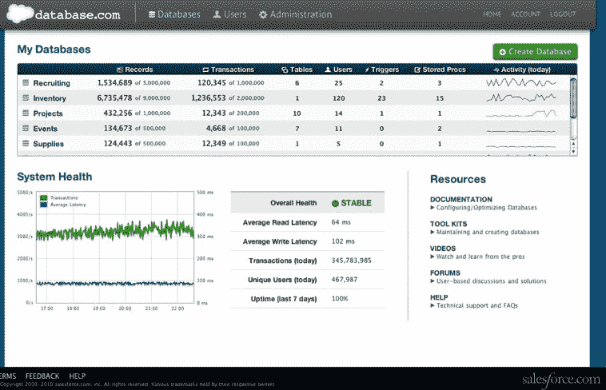
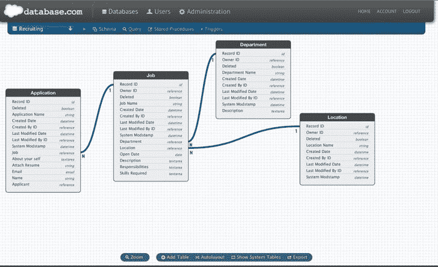

# 一个数据库统治云:Salesforce 为企业推出 Database.com TechCrunch

> 原文：<https://web.archive.org/web/http://techcrunch.com/2010/12/07/one-database-to-rule-the-cloud-salesforce-debuts-database-com-for-the-enterprise/?utm_source=feedburner&utm_medium=feed&utm_campaign=Feed%3A+Techcrunch+(TechCrunch>&utm_content=Google+Reader)

甲骨文已经统治了 T2 的数据库市场，尤其是在它以 74 亿美元收购了 T4 的太阳微系统公司之后。但是今天，随着 Database.com(该公司专为云构建的企业数据库)的发布，Salesforce.com 将成为一个更大的竞争对手。

对于使用任何语言、平台或设备的任何开发人员来说，Database.com 本质上是一个即插即用的存储基础设施。Salesforce 正在利用它用于支持自己的应用程序的相同技术，现在正在使它成为一个独立的服务，供开发人员创建他们的独立应用程序。作为 Salesforce 在云中的主要数据库，该公司将 Database.com 吹捧为最大的企业数据库之一，包含超过 200 亿条记录，每个季度交付超过 250 亿笔交易，平均响应时间不到 300 毫秒。

正如 Salesforce 首席执行官兼创始人马克·贝尼奥夫所说:“我们认为云数据库是一个巨大的市场机会，将推动向实时企业应用程序的转变，这些应用程序本身就是云、移动和社交的。”

为了支持基于云的应用程序，Database.com 将为企业应用程序提供基础设施，以实时提供更新和信息。开发人员可以用 Java、C#、Ruby、PHP 或更多语言编写他们的应用程序，并可以在任何地方运行他们的应用程序——在 Force.com、VMforce、亚马逊 EC2、谷歌 AppEngine、微软 Azure 或 Heroku 上。

应用程序也可以在任何设备上运行，如 iPad、iPhone、Android 或黑莓。Salesforce 表示，无论是小型应用还是支持数十万用户的应用，这些应用都可以调用 Database.com API。

比如安卓开发者可以编写连接 Database.com 的 Java 应用；或者，iPhone 应用程序开发者可以使用苹果工具，通过网络连接到 Database.com，用 Objective C 编写应用程序。网络开发者可以使用 Python、PHP 或 Ruby 在 Amazon EC2 上构建与 Databse.com 相抗衡的应用。

功能包括用户管理、行级安全性、触发器、存储过程、身份验证和 API，所有这些都在一个易于扩展的云基础架构中。该产品的关系数据功能包括表、关系、对各种字段类型的支持、触发器和存储过程、查询语言和企业搜索。支持存储所有类型的文件，包括文档、视频和图像。

Database.com 包括标准的 web 服务 API 和预建的社交数据模型和 API，用于订阅源、用户配置文件、状态更新和所有数据库记录的跟踪模型。例如，开发人员可以请求数据馈送来显示实时数据更新。

该基础架构承诺对远程数据中心进行自动调整、升级、备份和复制，并自动创建用于开发、测试和培训的沙箱。Database.com 提供企业搜索服务，允许开发者访问尊重企业安全规则的全文搜索引擎

在定价方面，Database.com 访问将对 3 个用户免费，每月最多 100，000 条记录和 50，000 次交易。该平台将对超过该基准的每组 10 万条记录每月收取 10 美元，对超过该基准的每组 15 万条交易每月收取 10 美元。企业级服务将为每个用户每月增加 10 美元，并将包括用户身份、认证和行级安全访问控制。

分析师估计数据库系统市场代表着 212 亿美元的市场，因此 Salesforce 寻求分一杯羹也就不足为奇了。随着云成为更可靠的基础设施形式，云中的数据库对应用程序来说是有意义的。

