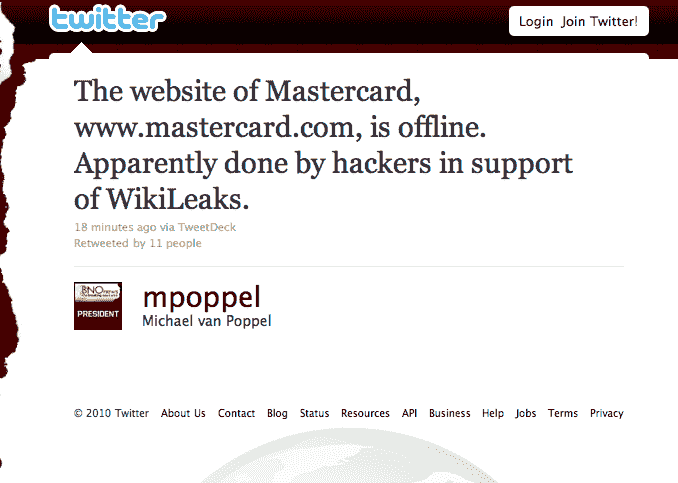

# 4Chan 关闭万事达网站支持维基解密| TechCrunch

> 原文：<https://web.archive.org/web/https://techcrunch.com/2010/12/08/4chan-takes-down-mastercard-site-in-support-of-wikileaks/>

# 4Chan 关闭万事达网站支持维基解密

为了报复[拒绝让万事达卡客户](https://web.archive.org/web/20230227193859/http://news.cnet.com/8301-31921_3-20024776-281.html)向维基解密捐款，4Chan 的黑客和网络警戒组织 Anonymous 成功地通过精心策划的 DDOS 攻击关闭了 Mastercard 的网站。

匿名支持的[行动](https://web.archive.org/web/20230227193859/http://twitter.com/Anon_Operation/status/12447755402215424)对这些攻击负责，也领导了之前针对 RIAA 的行动。“回报行动”通过推特账户 [@Anon_Operation](https://web.archive.org/web/20230227193859/http://twitter.com/Anon_Operation/status/12447755402215424) 和这里的[组织维基解密和朱利安·阿桑奇的支持活动。](https://web.archive.org/web/20230227193859/http://freebrains.dyndns.org/operation_payback/)

攻击还袭击了贝宝和瑞士邮政金融银行以及其他拒绝为阿桑奇提供服务的网站。EveryDNS.net、Visa 以及亚马逊也是可能的目标。

阿桑奇本人昨天在伦敦因性行为不端的指控而被捕，并将被拘留至 12 月 14 日。维基解密的传奇将如何收场还有待观察，但很明显，整个互联网将成为战场。