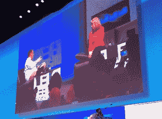
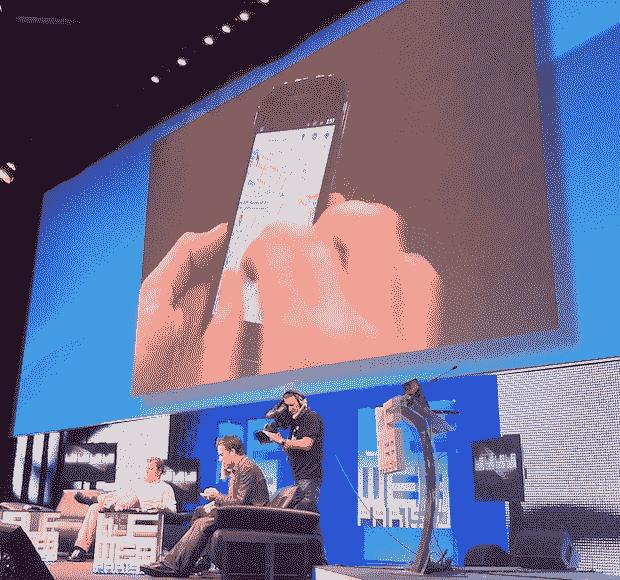

# 玛丽莎·梅耶尔的下一件大事:“上下文发现”——没有搜索的谷歌结果 TechCrunch

> 原文：<https://web.archive.org/web/http://techcrunch.com/2010/12/08/googles-next-big-thing/?utm_source=feedburner&utm_medium=feed&utm_campaign=Feed%3A+Techcrunch+(TechCrunch>)

今天在[le web’10](https://web.archive.org/web/20230203052729/http://www.leweb.net/)上，我们自己的[迈克尔·阿灵顿](https://web.archive.org/web/20230203052729/http://www.crunchbase.com/person/michael-arrington)上台与谷歌的[玛丽莎·梅耶尔](https://web.archive.org/web/20230203052729/http://www.crunchbase.com/person/marissa-mayer)对话。梅耶尔最近在谷歌接受了一份新工作。严格来说，她现在是公司的消费品主管。她在研究什么？

众所周知，位置是很重要的一部分。但她也在考虑一个更大的项目，谷歌仍在努力。这就是谷歌所说的“情境发现”。这意味着能够查看一个人的浏览档案或位置档案，并向他们提供有趣的数据，而无需他们搜索任何内容。没错，就是没有搜索的谷歌结果。

Mayer 说:“这个想法是把信息推给人们。她指出，在移动设备上，这尤其有趣，因为位置可以提供背景。她举的一个例子是当你在一个特定的餐馆时的菜单。她补充说，在你的设备上展示和看到这些会很棒——也许会根据你朋友的喜好带点社交色彩。

Mayer 说他们仍然在考虑所有这些的用户界面应该是什么样子，但是他们已经有了一些想法。它可能是浏览器中的一个面板。但在移动设备上，情况会有所不同。她说，他们目前正在试验一些东西，我们应该期待他们在明年左右会有所收获。

梅耶尔说:“我们试图建立一个虚拟的世界镜像。

**下面是我对整个讨论的现场记录(转述):**

马:那么，你现在有新工作了

MM:我们广义上称之为消费品。本地搜索，地图，地球，纬度，以及所有的本地产品。但这也是语境发现。把一个用户的位置作为一个上下文来寻找他们想要的东西，而不需要他们实际搜索任何东西。我们有一些正在试验的东西，但它将在明年推出。

马:为什么要放弃搜索，去做一些不一样的东西？

嗯，我已经做了大约 11 年了。我们是排名第一的网站和搜索引擎。是时候尝试新的东西了。本地和搜索有很大关系，所以我的知识转移了。但是现在我的团队里有了工程师。我手下有 800-1000 人。如果你把世界上各种各样的人都包括在内，那就更像是 2000 人。"*我们试图建立一个虚拟的世界镜像*"

马:我们再来谈谈语境发现。

这个想法是把信息推给人们。它在上下文中的位置。在浏览器和工具栏中，我们可以看到人们在网上去了哪里——然后我们交付它。但这是一个很大的 UI 挑战。在浏览器中，它可能是右边或底部的一个面板，补充你的浏览。在手机上，它是你在物理世界中的位置。我们可以找出下一个最有用的信息在哪里。在餐馆里，它可能是一份菜单。也可能是社交菜单。是关于显性和隐性的定位。

马:Latitude 是你们的产品之一。我们能不能同意这很糟糕？

MM:(笑)我用。

马:但你是一个狂热的 Foursquare 用户。

MM:我是。但是纬度对一小群人有用。只有少数人你会想知道你在哪里。会有新的层出现在它上面。人多了就更有用了。还有隐式和显式——没错，签到。也许是在纬度上，也许是在地图上。

马:你们在 iPhone 上推出了 Latitude，对吗？[我们看到了](https://web.archive.org/web/20230203052729/https://techcrunch.com/2010/12/07/google-latitude-iphone-app/)。

MM:很接近。我们对它感兴趣。(笑)

马云:在过去的 12 个月里，谷歌参与了三起大型收购。Yelp、Twitter 和 Groupon。你不必确认。但是为什么谷歌没能得到这些公司呢？所有的光泽都消失了吗？

我不能对任何情况发表评论。但每笔交易都不一样。公司越大，交易就越复杂。例如，Slide 是谷歌内部的一个自治系统。

马:什么是火锅——一个叫杀手？

MM:不是，是推荐引擎。它内置于手机地图和地点地图中。你可以去餐馆，快速评价。你可以和朋友或其他像你一样的用户建立联系。我们尽力为你提供好的建议。它是协同过滤加上社交组件。

马:你还记得巴斯吗？我不是那个意思。

我不认为 Buzz 真的是相似的，这是给本地事物评分的新方法。

马:谷歌社交+1，你能证实吗？

MM:很明显，社交对谷歌很重要。我们需要努力。

马:但如果你再搞砸了……你会变成微软，眼睁睁地看着脸书崛起吗？

MM:很明显这真的很重要。我们真的希望这次能成功。也就是说，我们真的很有耐心。有搜索、移动、本地和社交。我们答对了三题。我们正在研究第四个。

马:Twitter 如何融入生态系统？

MM:这是一个惊人的分配机制。以及一种消费信息的方式。但更多的是爆发出来。我们用它做火锅。Foursquare 也是一个很好的信号——我刚刚在这里签到。我刚在那里登记入住。Twitter 是一个伟大的产品。我经常使用它。

马:在接下来的 6 个月里，你们集团会进行收购吗？

MM:当然。我们几乎每周都会进行一次收购。我们一年做 1、2 或 3 个这样的大项目。AdMob，ITA，这些类型的交易总是在工作中。

——戴夫·伯克(Dave Burk)和工程人员在 Nexus S 上手拿姜饼———

DB:我们已经和三星合作开发这款设备大约 12 个月了。这是一个纯粹的谷歌体验设备。这是谷歌和安卓的精华。

MM:其中一个关键部分是谷歌手机地图。现在是谷歌地图移动版 5.0。我们现在有 1 亿人使用手机地图。

DB:我可以使用多点触控手势来获得 3D 视图。

MM:这是矢量地图。所以我们可以平滑地平移和缩放。

马:我喜欢的是新的墙纸。你只在美国或英国销售，对吗？去别的地方买一个？

DB:只有几个国家可以预订。圣诞节后我们就知道了。

马:你是怎么管理雅虎的？

我认为卡罗尔做了很多聪明的事情。必应搜索交易是明智的——我们希望是我们。但是他们正在做很多事情来使事情变得简单并保持相关性。

马云:谷歌的更多投资呢？你做了 Zynga。推特呢。

嗯，游戏是有道理的。但是其他的事情我们还得看看。

马:你是秘密委员会的吧？

MM:是的，OC。我们就是这么称呼它的——运营委员会。大概是十几个和公司做了很多的人。我们帮助运营公司。我真的很自豪能成为其中的一员。

马:你说的是杀产品，杀投资，对吧？

是的，这是真的。所有那些东西。

马:还要别的吗？

我们度过了令人兴奋的一周。Nexus S .姜饼。Chrome 操作系统。谷歌 Chrome 的 1.2 亿活跃用户。和 Chrome 网上商店。

马:这不是一个很好的扩展名称吗？

算是吧，但是它们是托管在网络上，而不是客户端。而且都是 HTML5。

马:Chrome OS 和 Android 比较呢？

我认为我们还没有真正决定。我们在 Chrome 操作系统中看到了很多希望。我们现在正期待它出现在笔记本上。它甚至不再是上网本了。Android 现在正走向平板电脑。但是两者的外形都可以适用于另一个。就像谷歌电视是建立在安卓之上的。开发者社区在这两方面都提供了帮助。

马:把 Chrome OS 下载到我的 MacBook 上怎么样？

MM:很难说。我无法推测。可能吧。最重要的是 Chrome OS 超级快。你打开笔记本电脑，它就准备好了。我回来的时候有一个在等我。