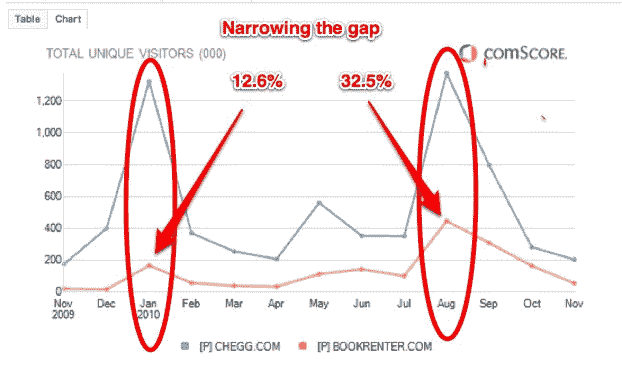
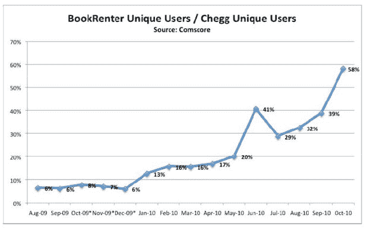
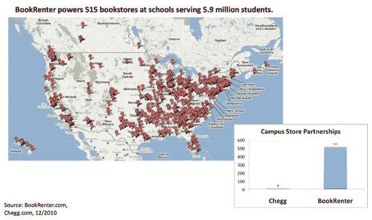

# Little Bookrenter 正在缩小与 Chegg TechCrunch 的差距

> 原文：<https://web.archive.org/web/https://techcrunch.com/2010/12/09/bookrenter-gap-chegg/>

# Little Bookrenter 正在缩小与 Chegg 的差距

当谈到快速增长的在线教科书租赁市场时，齐格网(T1)和 T2(T3)是需要击败的年轻巨头 T4。但是其规模较小的竞争对手，图书租赁公司，正在取得一些令人印象深刻的收益。如果你看看每个网站的流量，你会发现在每学期开始的时候流量会激增(见上图)。

去年 1 月，Bookrenter 的流量只有 Chegg 的 12.6%，而到了 8 月份的高峰时，它的流量达到了 32.5%。根据 comScore 的数据，从高峰到高峰，Bookrenter 的流量增长了 167%，达到每月 446，000 名美国独立访客。然而，齐格网 8 月份的流量与 1 月份的高峰时期大致相同:130 万。下面的图表由 Bookrenter 提供，显示了 Bookrenter 的流量在 Chegg 的流量中所占的百分比是如何增长的。10 月份是 58 %,但这个数字没有本学期早些时候租赁高峰期的百分比有意义。

我们确实知道流量和销量之间有直接的关联，但是，从这些数字中还不清楚每个学生平均借了多少本书。Bookrenter 首席执行官 Mehdi Maghsoodnia 表示，他在秋季学期售出了大约 50 万本书。如果你计算每本书的平均租金约为 50 美元，这意味着 Bookrenter 上学期的销售额为 2500 万美元。那是 Bookrenter 进入[超增长](https://web.archive.org/web/20230204233903/https://techcrunch.com/2010/09/01/textbook-rentals-go-into-hypergrowth-bookrenter-says-revenues-are-growing-725-percent/)的那个学期。再加上春季学期售出的 125，000 本书，根据我的粗略计算，Bookrenter 今年的收入将略高于 3，000 万美元。预计 Chegg 今年的收入将达到约 1.3 亿美元。Bookrenter 仍有很长的路要走，但它也没有筹集到超过 2 亿美元的风险投资，它只筹集了 2000 万美元。

Bookrenter 的增长很大程度上得益于其与大学书店的合作关系。自从去年 3 月与校园书店合作以来，Bookrenter 现在是美国 515 所大学书店的官方图书租赁平台，为 600 万学生服务，占大学人口的 31%。全国有 6000 到 7000 家大学书店。哦，Bookrenter 现在也入侵加拿大了。

