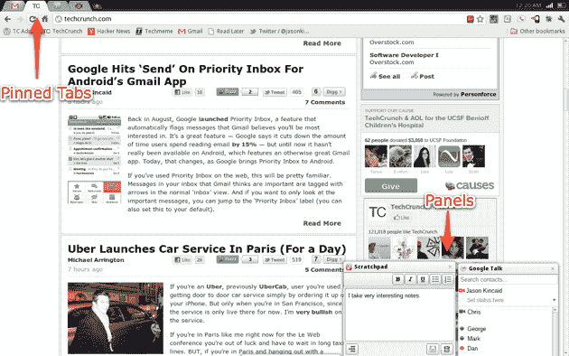
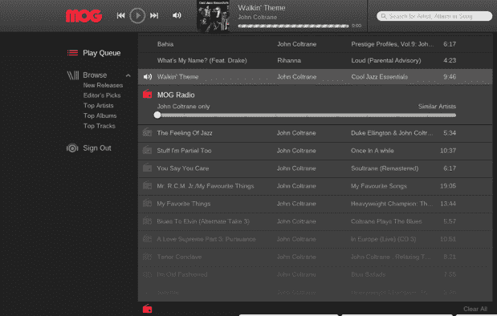
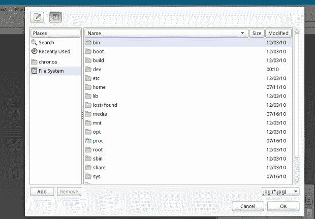

# 云中漫步:我使用谷歌 Chrome OS TechCrunch 的第一天

> 原文：<https://web.archive.org/web/http://techcrunch.com/2010/12/10/chrome-os-review/>

你可能已经听说了，本周早些时候，谷歌在举行了一场[大型活动，发布 Chrome 网络商店和 Chrome OS，这是其新的操作系统，几乎完全围绕着网络应用和浏览器扩展。目前还没有任何支持 Chrome OS 的消费笔记本电脑——明年年中之前也不会有——但谷歌正在进行一项测试计划，通过分发一些未知数量的代号为 Cr-48 的无品牌“测试硬件”，在全美范围内推动和选择早期采用者。今天早些时候，我们拿到了其中一台设备，从那以后，我就一直把它作为我的主要电脑。以下是我的初步想法。](https://web.archive.org/web/20230203040022/https://techcrunch.com/2010/12/07/live-from-googles-chrome-event-chrome-os-web-store-and-more/)

鉴于华硕等原始设备制造商将在未来几个月内发布自己的产品，而你实际上无法购买 Cr-48，在这一点上对硬件进行彻底的批评并没有什么意义。但这里有一些基本的东西:这款电脑很小，但远没有 MacBook Air 这样的超便携电脑轻(我发现它更像 2005 年左右的 12 英寸 PowerBook G4)。有一个 USB 端口，目前有有限的驱动程序支持，一个 SD 卡插槽，和一个 VGA 端口。

键盘是全尺寸的，感觉很像现代苹果电脑上的键盘。鼠标触控板——或者至少是运行触控板的软件——完全是一坨屎。对于基本的指向和点击来说，它已经足够好了，但是除此之外就有问题了。包括用两个手指在触控板上点击的“右击”功能似乎只在当时的⅔出现过。试图选择文本或拖动任何东西到任何地方都是一种挫折。

快吗？算是吧，但并不是所有人都这么快。点击一个标签，你会注意到在内容显示之前会有一点延迟——这并不明显，但这种事情会让体验不那么流畅。同样，在内容丰富的网页上滚动有时会导致一些抖动，偶尔事情会在没有明显原因的情况下变慢一会儿。

但所有这些事情——从硬件到软件问题——肯定会在五六个月内得到改善，然后我们才会开始看到消费者获得第一批生产 Chrome OS 笔记本电脑。事实上，Flash 的速度非常慢并不重要，因为百分之九十以上阅读这些问题的人甚至没有机会使用 Cr-48。到这些东西上架的时候，所有这些问题都将得到解决。

但一个大问题仍然存在:实际上生活在云中会怎么样——人们能够放弃他们的传统电脑而选择轻量级的 Chrome OS 机器吗？

答案是“很有可能”，但是，正如我稍后会谈到的，这将部分脱离谷歌的控制。

在一个本质上是浏览器的操作系统中导航，起初感觉有点奇怪。您的音乐应用程序是一个浏览器标签。你的电子邮件是一个浏览器标签。您的文档是浏览器选项卡。当然，你可能以前在基于网络的应用程序中使用过一些或者甚至所有这些，但是你很难摆脱这种感觉，你正在寻找的应用程序在你的浏览器后面，或者在任务栏中最小化，或者…什么的。我知道这听起来不合理，但在使用分层窗口操作系统十年(或二十年)后，这个系统需要一点时间来适应。你知道那种感觉吗，当你开始驾驶一辆你从未驾驶过的车，一切都有点不协调？有点像那样。

幸运的是，学习曲线似乎并不陡峭。至少对我来说，关键是“固定标签”功能。这在 Chrome 的“普通”版本上一直很好，但我发现它在 Chrome OS 中是不可或缺的。如果你不能组织你的应用程序，你会发现自己每隔几分钟就要筛选十几个标签，这是非常令人沮丧的。但是如果你把你最常用的应用程序和网站作为固定标签打开——我现在有 Gmail、MOG、Twitter 和 TechCrunch 突然事情就变得更有意义了。

【T2

Chrome OS 还有一些其他的技巧可以让你感觉更自在，其中最大的是它的面板功能(按照谷歌 UI 标准，这其实是非常巧妙的)。下面是 Chromium 项目网站对它们的描述:

> Chromium OS 中的面板被用作容器，允许用户在不离开当前应用程序视图的情况下进行多任务处理。例如，使用音乐播放器和面板中的聊天，用户可以在观看视频或阅读主视图中的长文档时控制音乐的播放并与朋友聊天。

在实践中，这些小部件位于屏幕底部，向上窥视时，你可以将鼠标指向它们，但当你不使用它们时，它们只占用很少的空间。将你的鼠标移向这些面板，它们会向上滑动一点以显示它们的标题；点击其中一个，它会一直滑动，显示你的即时消息对话，记事本，或任何你打开的东西。您可以调整这些面板的高度和宽度，对于您需要快速、频繁访问的任何内容，它们都非常方便。到目前为止，我唯一的问题是:我在 Chrome 网上商店找不到支持面板的应用程序；显然你现在得自己去找他们。

我目前的 Chrome 扩展套件也让我有宾至如归的感觉(我使用了同步功能来自动移植我桌面的当前设置)。我的谷歌语音通知器、Chrome-to-Phone 和字典扩展都非常好用。

几天后，一旦我有机会清理我安装的一系列网络应用程序，我会有更多的东西要写。不过，到目前为止，我已经有了一些早期的最爱。MOG 的音乐应用程序(试用期后需要订阅)是 iTunes 的良好替代品。MOG 实际上为这款网络应用重新设计了 UI，让它看起来更像你习惯的全屏音乐浏览器，到目前为止，它对我来说工作得很好。

我也很确定——虽然我有点犹豫——我可以依赖 Aviary 的图像编辑器作为 Skitch 和(在某些情况下)Photoshop 的合适替代品。在 Chrome 操作系统上编辑图片总的来说感觉很奇怪，因为我已经习惯了在本地处理这些文件。Aviary 的应用程序可能会有点迷失方向，因为你被扔进了另一个窗口，然后不得不处理各种共享选项，以实际获得你刚刚编辑的图像。我相信你可以将内容保存到计算机的磁盘上，但文件管理器似乎还没有完成。

今天有一次，我偶然发现了 Chrome OS 的文件浏览器。如果您从未深入研究过操作系统的文件系统，这可能会吓到您。没有“我的照片”或“桌面”这样友好的文件夹——相反，你会发现无数目录的名字可能只对 Linux 用户有意义。我希望谷歌能在 Chrome 操作系统投入生产前大幅简化这一过程，因为任何“正常”的人只要点击这个屏幕都会感到无助。

更重要的是缺乏“T2”的支持。1 密码是一个很好的密码管理器(当然还有其他的)，虽然它有一个 Chrome 扩展，但似乎不能与 Chrome 操作系统一起使用。不幸的是，这意味着我最终不得不拿出手机来查找我需要的密码，这很痛苦。

这就引出了我的最后一点。

我怀疑谷歌是否乐意将 Chrome 的消费者发布推迟到明年，但这个测试和反馈窗口可能会非常有价值。谷歌在未来几个月将做出的改进并不像为该平台优化的第三方软件的创建那样重要。

我越想它，我就越相信 Chrome 缺乏驱动程序支持，它的用户界面小故障，以及谷歌宣称的“测试软件”的愿望都是某种形式的转移话题。同样重要的是，或者更重要的是，Chrome 操作系统将严重依赖第三方来填补其功能空白。在这一点上，第三方支持还有很长的路要走。

很多应用程序都可以像 Chrome 操作系统面板一样运行良好，但是他们的开发人员仍然需要构建它们。网络应用程序(不仅仅是谷歌文档)迫切需要支持离线存储。而且像 1Password 这样的一些应用程序根本不支持 Chrome 操作系统。

现在，在接下来的六个月左右的时间里，谷歌将有成千上万的用户加入 Cr-48，你可以肯定，这一群人——主要由早期采用者和开发者组成——在遇到棘手问题时会非常直言不讳。当这些东西(或者他们更精致的同类产品)开始运输时，我怀疑大部分缺口都会被填补。

如果不清楚的话，Chrome 操作系统将会是一件大事。这不仅仅是针对早期采用者的，而且，只要谷歌和第三方开发者能够填补剩余的功能空白并添加一些修饰，它也不会被平板电脑的崛起所压倒。不，这不会吸引那种可以把苹果平板电脑作为主要电脑的人，但它最终可能会成为工作场所微软视窗系统的一个可行替代品，甚至可能会开始在苹果 OS X 吃家里用的东西。

敬请关注。在接下来的几天里，我们会有更多的内容要说。

*注意:你可能也想看看丹尼·沙利文[对](https://web.archive.org/web/20230203040022/http://searchengineland.com/first-day-review-the-google-chrome-os-cr-48-notebook-58322)第一天使用 Chrome 操作系统的回顾——他也遇到过类似的密码管理器问题。*