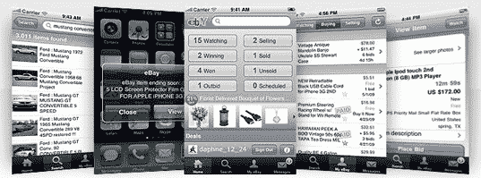

# 易贝昨日公布了创纪录的 1300 万美元移动销售总额；增长 165% TechCrunch

> 原文：<https://web.archive.org/web/http://techcrunch.com/2010/12/13/ebay-posted-record-13m-in-gross-mobile-sales-yesterday-up-165-percent/>

# 易贝昨日公布了创纪录的 1300 万美元移动销售总额；增长了 165%

易贝[在这个假期创造了手机销售的记录](https://web.archive.org/web/20230203141659/http://www.businesswire.com/news/home/20101213006698/en/eBay%C2%AE-Shoppers-Flock-Phones-Set-Records-Busiest)，宣布昨天是该市场有史以来通过手机销售商品总值(也称为 GMV，通过易贝销售的商品的总销售额)最大的一天。12 月 12 日周日，与去年同期相比，易贝移动 GMV 公司在美国增长了 127%，达到 500 万美元，在全球增长了 165%，达到 1300 万美元。

在美国，易贝移动 GMV 公司在易贝现在称之为“移动星期天”的活动中，与今年在 T4 网络星期一 T5 的销售相比，增长了 38%。就销量而言，哪些产品表现最好，服装和配饰位居榜首，其次是汽车&卡车和珠宝&配饰。

销量排名前五的美国州包括加利福尼亚州、宾夕法尼亚州、佛罗里达州、印第安纳州和俄亥俄州。在昨天美国市场购物狂潮的高峰期(美国东部时间下午 1 点至 4 点)，易贝每小时有超过 9500 笔交易。

当然，易贝一直在大力推出和推广其新的移动产品，以赶上假期。随着越来越多的消费者将手机作为搜索和购买产品的一种方式，易贝的应用程序获得了更多的流量。易贝的主要 iPhone 应用程序已经被下载了 1300 万次，它的应用程序套件已经被下载了 3000 万次。

对易贝来说，网络星期一和黑色星期五的销售持续增长是个好消息，这两天往往是许多零售商的高峰期。这家电子商务巨头调整了对感恩节假期后一年的预测，称其市场的移动销售额将超过 15 亿美元。