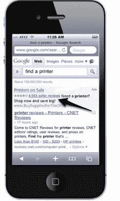

# 谷歌移动搜索在第三季度增长了 130%

> 原文：<https://web.archive.org/web/http://techcrunch.com/2010/12/13/google-mobile-searches-grew-130-percent-in-q3/>

# 谷歌移动搜索在第三季度增长了 130%

随着越来越多的消费者使用手机进行商业和产品搜索和购买，零售商的移动广告形式正成为与这些用户联系的更具吸引力的方式。今天，谷歌[将](https://web.archive.org/web/20230308120152/http://googlemobileads.blogspot.com/2010/12/better-shopping-with-seller-ratings.html?utm_source=feedburner&utm_medium=feed&utm_campaign=Feed:+GoogleMobileAdsBlog+(Google+Mobile+Ads+Blog))的卖家评级广告格式引入移动平台，允许在移动网络上使用谷歌的搜索者在搜索广告中看到商家的评级。邮报的另一个有趣的消息是，2010 年第三季度，谷歌移动搜索同比增长了 130%。

类似于基于网络的搜索广告的卖家评级，移动格式允许广告商包括一个企业的评级。卖家评级是从商家评论网站汇总的，谷歌表示，只有当商家的在线商店评级达到四星或以上，并且至少包含 30 条评论时，该扩展才会显示。

广告本身显示了商家的星级，并发布了一个指向卖家评论的链接。谷歌表示，带有卖家评级的移动广告格式仅适用于 Google.de、Google.co.uk 和 Google.de 域名。谷歌警告说，这些类型的广告只适合“向用户提供付费商品或服务的广告商，或者那些通过市场买卖产品或服务的广告商。”

毫不奇怪，谷歌正在继续加大其在移动搜索服务方面的努力。就移动收入而言，谷歌已经做得相当不错了(在该公司的[上一次收益电话会议中，](https://web.archive.org/web/20230308120152/https://techcrunch.com/2010/10/14/google-earnings-slides-third-quarter-2010/)搜索巨头称移动搜索有望在 2010 年成为 10 亿美元的业务)。在[的电话中，](https://web.archive.org/web/20230308120152/https://techcrunch.com/2010/10/14/google-revenue-numbers/)谷歌 SVP 产品管理部的 Jonathan Rosenberg 说，移动搜索查询在过去几年里增长了五倍。