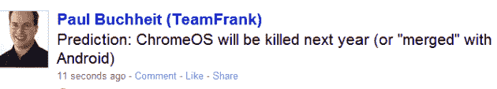

# Gmail 创始人 Paul Buchheit: Chrome 操作系统将灭亡或与 Android“合并”

> 原文：<https://web.archive.org/web/https://techcrunch.com/2010/12/14/gmail-creator-paul-buchheit-chrome-os-will-perish-or-merge-with-android/>

# Gmail 创始人保罗·布赫海特:Chrome OS 将灭亡或与 Android“合并”

前谷歌公司、FriendFeed 创始人和[脸书-尔](https://web.archive.org/web/20221007200732/http://www.beta.techcrunch.com/2009/08/18/video-interview-with-friendfeed-ceo-paul-buchheit-on-facebook-acquisition/)转为投资者 保罗·布赫海特刚刚[发了](https://web.archive.org/web/20221007200732/http://twitter.com/#!/paultoo/status/14631053989773313)条微博:

> 预测:ChromeOS 将于明年被杀(或与 Android“合并”)

考虑到他的前雇主上周刚刚推出 Chrome 操作系统试点项目，这一评论可能会让山景城感到有点刺痛，尽管应该注意到 Buchheit 不是唯一一个预测谷歌基于 Linux 的操作系统将很快步上浪潮的后尘的人。

谷歌迄今为止一直认为，其两个操作系统 Android 和 Chrome OS 面向不同的市场，尽管它们运行的设备(上网本、平板电脑、智能手机)越来越趋同，但这些市场仍将保持差异。然而，谷歌联合创始人谢尔盖·布林(Sergey Brin)在过去曾表示，谷歌可能会“在未来开发出单一的操作系统”。

具有讽刺意味的是，Chrome OS 项目的关键架构师[马修·帕帕基波斯](https://web.archive.org/web/20221007200732/http://www.crunchbase.com/person/matthew-papakipos)在今年夏天[离开了谷歌，去了保罗·布赫海特最近的前雇主脸书](https://web.archive.org/web/20221007200732/https://beta.techcrunch.com/2010/06/28/closing-in-on-chrome-os-launch-key-architect-matthew-papakipos-jumps-to-facebook/)工作。

如果这个人少于 140 个字符的预测是正确的，Android 将成为主导的操作系统——考虑到它目前的牵引力,这并不令人惊讶——而 Chrome OS 将在 2011 年结束前灭亡。

**更新:**更多来自 [FriendFeed 中的 Buchheit 线程](https://web.archive.org/web/20221007200732/http://friendfeed.com/paul/1af77944/prediction-chromeos-will-be-killed-next-year-or):

> ChromeOS 没有比 Android 更好的用途(可能会有一些 mod 来支持非触摸显示屏)。
> 
> 我在想，“这是不是太明显了，甚至无法陈述？”，但后来我看到人们认真对待 ChromeOS，谷歌甚至出于某种原因在发运设备。

你同意他的论断，还是认为 Chrome OS 和 Android 可以共存？