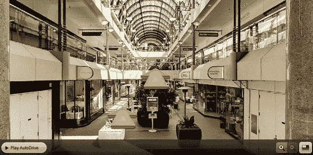

# 除了街道，Bing 还将从 EveryScape TechCrunch 添加当地企业的内部视图

> 原文：<https://web.archive.org/web/https://techcrunch.com/2010/12/15/bing-everyscape-interior-views/>

# 除了街道，Bing 还将增加来自各个地方的本地商业内部景观

街道的全景照片现在是在线和移动地图的标准，谷歌街景是最知名的例子。Bing 有自己的 3D 街边照片版本,覆盖在地图上，但由于与 [EveryScape](https://web.archive.org/web/20221007011024/http://www.everyscape.com/) 的合作，很快它将开始增加进入建筑物内部和四处查看的能力。该功能将被称为“内部视图”，它将允许人们在视觉上探索当地的企业和其他建筑。当本地搜索结果可用时，它将作为一个选项出现在本地搜索结果旁边。你可以在旧金山的这个购物中心看看这项技术的例子。

EveryScape 多年来一直在研究这项技术，并在去年 2 月筹集了 600 万美元，以更积极地追求室内照片地图空间。EveryScape 向当地企业收费，让他们拍摄内部照片，并把它们放在地图上。现在，与必应地图的合作将使销售变得更加容易。

然而，要想真正实现这一点，EveryScape 需要向 Bing 付费，开始创建热门景点的内部视图。(也许这是交易的一部分，我不知道)。否则，该功能将永远不会被触发。它需要成为探索这些地图的一部分，在手机上尤其有用。只要有，就会有一个“步入”图标。但是如果你认为街景引起了一些隐私问题，等到人们开始在这些照片中看到自己。