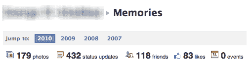
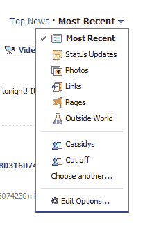

# 脸书的大日子:新页面、记忆和停工期

> 原文：<https://web.archive.org/web/http://techcrunch.com/2010/12/16/big-day-for-facebook-new-pages-memories-and-downtime/>

脸书今天过得相当有趣。今天早上，该网站为第三方网站推出了一个漂亮的新[注册小工具](https://web.archive.org/web/20230222212444/http://developers.facebook.com/blog/post/440)。在过去的几个小时里，它还推出了其页面的改版版本，这使得用户界面更加符合本月早些时候推出的[更新的个人资料设计](https://web.archive.org/web/20230222212444/https://techcrunch.com/2010/12/05/new-facebook-profile/)。Twitter 上有很多关于新的“记忆”功能的报道，这个功能可以让你浏览你在网站上的全部历史。

不幸的是，你现在看不到任何一个，因为脸书——以及散布在网络上的无数类似的按钮——都被关闭了。**更新**:截至太平洋时间下午 1:45，我已经备份了。

考虑到它的大规模分布，以及它是许多网站的主要登录系统这一事实，任何宕机对脸书来说都是一件大事。我们将在网站恢复后进行更新——到目前为止，网站似乎已经关闭了大约 15 分钟。现在，让我们回顾一下脸书推出的特性(显然有点太快了)。

新的脸书页面看起来很像脸书广场页面和更新的用户资料。应用程序标签已经从墙上的导航栏移到了左侧栏，就在页面主图像的下面。页面现在还可以显示脸书用户的列表，就像你可以在你的脸书个人资料上显示你的朋友一样。还有一个新按钮可以让页面管理员“以页面身份登录”，这可以让你只接收你的页面的通知，而不是你的个人帐户。

《脸书回忆》仍然有点神秘，因为根据该专题的大量推文，它每次只出现几分钟。[下一个网站](https://web.archive.org/web/20230222212444/http://thenextweb.com/apps/2010/12/16/facebook-testing-memories-feature/)捕捉到了一个用于记忆的导航条(见下文),但它并没有展示这个功能实际上是什么样子。

通过 Twitter 上的报道，Memories 可以让你浏览你在脸书的整个历史，浏览所有的评论、照片和你随着时间的推移建立的联系。一些用户将其描述为令人毛骨悚然，不清楚你是否可以查看你朋友的记忆标签(这有点奇怪)或只是你自己的。如果你有机会尝试这个功能，请在评论中告诉我们，我们已经联系了脸书以获取更多信息。

**更新:**:脸书现在又回来了，但是更新的页面设计和记忆好像都没了。

**更新 2:** :脸书显然也在测试一个名为“外部世界”的新闻供稿新选项。目前还不清楚这是什么，但它可能是热门新闻故事、视频和其他在线分享内容的排名列表。这张图片来自 Twitter 上的 [Casschin](https://web.archive.org/web/20230222212444/http://twitter.com/casschin) :

**更新 3** :脸书刚刚[发推文](https://web.archive.org/web/20230222212444/http://twitter.com/facebook/status/15530919284703232)称“一些内部原型暴露给了人们，导致我们短暂关闭了网站。现在已经恢复正常了。”所以看起来我们还不会看到记忆或“外部世界”的景象。