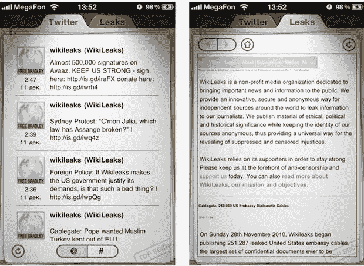
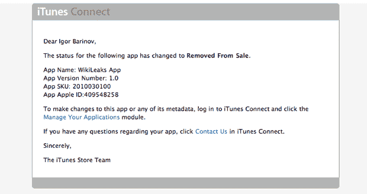

# 苹果从应用商店 TechCrunch 移除维基解密应用

> 原文：<https://web.archive.org/web/http://techcrunch.com/2010/12/20/apple-removes-wikileaks-app-from-app-store/?utm_source=feedburner&utm_medium=email&utm_campaign=Feed%3A+Techcrunch+(TechCrunch>&utm_content=Yahoo!+Mail)

# 苹果从应用商店移除维基解密应用

看起来像一个非官方的 iPhone 和 iPad 应用程序，可以让你查看维基解密网站的内容，并随时关注维基解密的 Twitter 账户，今天早些时候已经被[从应用程序商店移除。](https://web.archive.org/web/20230203144427/http://twitter.com/#!/wikileaksapp/status/17096892194226176)这个应用曾经可以在[这里](https://web.archive.org/web/20230203144427/http://itunes.apple.com/gb/app/wikileaks-app/id409548258?mt=8#&partnerId=30&siteID=TnL5HPStwNw-_J4UCNXx2PT0I8aj3UlNaQ)(这里是[谷歌缓存](https://web.archive.org/web/20230203144427/http://webcache.googleusercontent.com/search?q=cache:pOoeRIc-9g0J:itunes.apple.com/us/app/wikileaks-app/id409548258%3Fmt%3D8+wikileaks+app&cd=3&hl=en&ct=clnk&gl=us))。

根据维基解密应用的描述:

*“维基解密的应用程序可以让你即时获得世界上最有记录的绝密备忘录和其他政府机密文件的泄露信息。”*

基本上，这个付费应用程序以 1.99 美元的价格出售维基解密的内容(免费提供)。它在 12 月 17 日进入 app store 实际上令人惊讶，因为苹果通常对其应用审批标准相当严格，有些模糊。说得轻一点，维基解密和创始人朱利安·阿桑奇颇具争议，但我不确定这款应用是否直接违反了苹果的服务条款。

在过去的几周里，大公司亚马逊、贝宝、万事达、维萨和美国银行都试图以这样或那样的方式与维基解密撇清关系。如果这不是某种故障，苹果有很多公司。

我已经联系了苹果和开发者了解更多信息，当他们回复时我会更新这个帖子。

感谢: [Appsfire](https://web.archive.org/web/20230203144427/http://appsfire.com/)

**更新:**开发者 Igor Barinov 回复了以下官方状态更新，显示该应用确实已下架。

