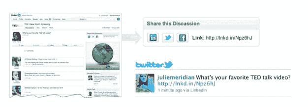

# 职业社交网络 LinkedIn 将团体上市 TechCrunch

> 原文：<https://web.archive.org/web/http://techcrunch.com/2010/12/20/professional-social-network-linkedin-takes-groups-public/>

# 职业社交网络 LinkedIn 将团体上市

LinkedIn Groups 于 2009 年 8 月推出，允许专业社交网络上的任何人围绕特定主题或专业创建论坛，用户可以在论坛上发表评论并分享新闻和信息。6 月，LinkedIn [更新了](https://web.archive.org/web/20230203073959/https://techcrunch.com/2010/06/22/linkedin-takes-groups-to-the-next-level-with-likes-follows-and-more/)的群组功能，增加了喜欢讨论、关注群组等功能。截至今天，LinkedIn 在该平台上拥有超过 75 万个群组。

如今，这个拥有 8500 万用户的社交网络[向公众开放](https://web.archive.org/web/20230203073959/http://blog.linkedin.com/2010/12/20/linkedin-open-groups/)群组，允许管理员在网络和 LinkedIn 上搜索讨论。对于公共组，任何 LinkedInmember 如果不是特定组的成员，都可以查看组的讨论。LinkedIn 还允许用户在 Twitter 和脸书上分享群体讨论的链接。

管理员还可以限制群组的隐私。如果管理员切换到开放群组，LinkedIn 会让所有成员知道这一变化，并且未来的讨论将在网上可见。该小组的成员可以通过成员专用的档案来访问私人时间段的过去讨论。

群组功能已经类似于脸书式的界面，旨在将社交对话引入专业网络。但通过向公众开放群组，LinkedIn 允许用户在网络上传播对话，这可能有助于该网络成为更多的社交目的地，而不仅仅是一个网络中心。下面是 TED 的[开放组的一个例子。](https://web.archive.org/web/20230203073959/http://www.linkedin.com/groups/WikiLeaks-Good-Bad-Who-benefits-138801.S.37756990)