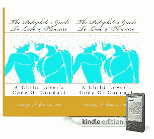

# 被捕:亚马逊禁止 TechCrunch 出版的恋童癖书籍的作者

> 原文：<https://web.archive.org/web/https://techcrunch.com/2010/12/20/under-arrest-the-author-of-that-pedophilia-book-amazon-banned/>

# 被捕:亚马逊禁售的恋童癖书籍的作者

还记得那本卑鄙的电子书[《恋童癖者的爱与快乐指南:一个儿童爱好者的行为准则》](https://web.archive.org/web/20230219082542/https://techcrunch.com/2010/11/10/kindle-pedophile-book/)吗？它曾短暂地登上亚马逊[100 本畅销书排行榜](https://web.archive.org/web/20230219082542/https://techcrunch.com/2010/11/10/amazon-fail/)的榜首，却在这家互联网零售商面临[巨大的顾客和媒体压力](https://web.archive.org/web/20230219082542/https://techcrunch.com/2010/11/10/amazon-banning-one-vile-ebook-a-victory-for-what-exactly/)之后[被撤下](https://web.archive.org/web/20230219082542/https://techcrunch.com/2010/11/10/amazon-pedophile/)？

好吧，据佛罗里达州[新闻 13](https://web.archive.org/web/20230219082542/http://www.cfnews13.com/article/news/2010/december/185471/Polk-Sheriff:-Pedophile-author-arrested) 报道，这本书的作者菲利普·r·格里夫斯二世今天因违反淫秽法被捕。

据新闻媒体报道，波尔克县治安官办公室与科罗拉多州普韦布洛当局一起，以三级重罪指控逮捕了这名精神不稳定的男子，在佛罗里达州，这一罪名最高可判处 30 年监禁。

波尔克警长格雷迪·贾德告诉新闻 13 台，调查此案的侦探研究了这本书，并询问是否能得到一本，最终导致了逮捕。

> “他写这本书是专门教人们如何猥亵和强奸儿童，”贾德说。"你不能让孩子们参与进来，也不能用有害的眼光来描绘他们."

格里夫斯最早可能于今天被引渡到波尔克县。

(感谢[奥斯顿·本生](https://web.archive.org/web/20230219082542/http://superconf.net/)的提示)