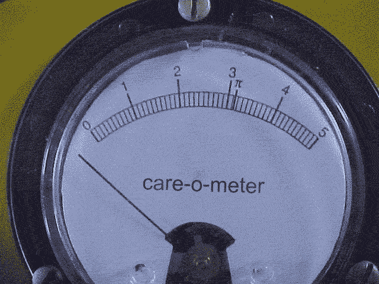

# 亲爱的科技早期用户:制造商不关心你

> 原文：<https://web.archive.org/web/http://techcrunch.com/2010/12/21/dear-tech-early-adopters-manufacturers-dont-care-about-you/>

过去几周，我们一直在 CrunchGear 围绕[概念墨水](https://web.archive.org/web/20230210054536/http://crunchgear.com/tag/Notion-ink)平板电脑(以及一般意义上的平板电脑)进行一场精彩的小型对话，我认为讨论一些毒害技术(尤其是硬件)的神奇思维可能会很有趣。因为你和我都在阅读科技博客，而且因为科技博客主要是为了迎合早期用户，所以有一个持续不断的规格、速度、反馈，以及相当多的粉丝和反粉丝“一厢情愿”地描述这种未来功能或某些制造商的未来设备。“新的摩托罗拉平板电脑将杀死所有其他的平板电脑，”我们喊道，肯定和正确的！“安卓永远比 Windows Phone 7 好”，我们尖叫！然后有人回复了相反的意见，就像大金刚一样。例证:今天，我被鼓励结束自己的生命，因为我承认自己对某个特定设备的负面看法。感谢上帝，这不是一个政治博客，否则我会被砸死在某个深谷。

让我来说明我的第一点也是最重要的一点:地球上 99%的人口对 Android、iOS、OS X、Windows、Honeycomb、Tegra 2、Sand Hill 或 SSD 毫不关心。他们想打开电脑，给朋友发邮件，然后关机。他们希望通过黑莓手机获得订单，给员工发电子邮件，然后回到他们作为花匠、木匠和银行出纳员的工作岗位。套用路易斯·CK 的话，他们拥有一家景观美化公司，他们受人尊敬，为什么他们需要“热”设备？他们肯定没有时间去浏览规格表，更不用说去关心那些规格表说了些什么。

在所有公司中，微软最明白这一点。从他们最初的以[杰瑞·宋飞](https://web.archive.org/web/20230210054536/http://www.crunchgear.com/2008/09/05/bill-gatesjerry-commercials-raisin-rhetoric/)为主角的 WTF 广告，到他们最近的一批[笔记本电脑猎人](https://web.archive.org/web/20230210054536/http://www.crunchgear.com/2009/07/08/video-latest-laptop-hunters-ad/)广告，最后，他们对 Windows Phone 7 的“搞定一切”处理，微软营销的一切都是关于减少人机交互。创造了书呆子的公司现在想让你明白，它知道你不是书呆子，你想在生活中做些有趣的事情，而不是上网。

【YouTube = http://www . YouTube . com/watch？v=EHlN21ebeak&fs=1&hl=en_US]

技术问题很少成为主流。事实上，可以说上一次一个真实的、诚实的技术问题进入更广阔的世界是整个天线门丑闻。没有什么比这一丑闻更能激起全世界的兴趣了，这一事件的导火线——泄密、无数的采访、已经很流行的设备——给本质上是关于无线电动力学的争论增加了弗里松。除了关于进化和儿童疫苗接种的古老争论之外，上一次任何其他科学话题通过话题兴趣的障碍进入主流是什么时候？当然，NYT 的科学部分做了一些很棒的报道，但是很难将体育和天气之间的高科技新闻与斯克兰顿的头号主播丽莎·休斯一起放在 10 点钟的新闻中。

除此之外，所有这些引用规范和粉丝主义都是一种娱乐，我自己承担风险，我同意这些娱乐中固有的粉丝主义。当然，我们报道新闻，我们的绝大多数帖子都有一些核心新闻。我们很少写博客，尽管经常有例外。但当我的一个朋友称史蒂夫·乔布斯为法西斯主义者时，我必须提醒他，在这本伟大的生命之书中，墨索里尼可能更接近法西斯主义者。史蒂夫·乔布斯将会像爱迪生一样被人们记住——目光锐利，干劲十足，容易窃取智慧，擅长创造重要的硬件。

也就是说，我的第一点是什么？我的第一点是，这些东西对“世界”和制造商来说，远没有我们想象的那么重要。大多数产品都有 6 个月的准备期。CES 上展出的产品可能已经完成，或者至少是由*去年* CES 制作的原型，而今天进入研发和生产的东西将会在今年夏天让你大吃一惊。这个行业就是这么运作的。很少有公司会关注我们无休止的、伤感的诽谤，当他们关注时，这是一个令人愉快和有趣的惊喜。以谷歌电视为例。谷歌的电视团队实际上打电话给我们，问我们对谷歌电视的看法，在一些小的方面，我们希望我们为这个世界做了一点好事。但是对于每一个谷歌电视团队(谷歌不生产硬件，所以他们可以和博主们玩一会儿)，都有一个苹果或索尼或戴尔，这些公司认为我们是一群贫穷的寄生虫。

其次，科技写作的目标首先是提供信息，其次是引导消费者远离过时和背叛的浅滩。制造商知道没有人阅读或关心规格，所以他们会出售各种垃圾，从沃尔格林 99 美元的“平板电脑”到装满臃肿软件的残缺笔记本电脑。这并不是说所有的厂商都讨厌我们，但他们绝对不爱我们。他们需要在下一批大货到来之前卖掉他们的存货。这是否意味着可笑地降低价格，或者把他们的产品卖给天空商城目录上的更多不知情的人。这是生意。一个企业需要产品、分销和客户，而理想的客户是一个不知道甜甜圈、丹麦、蜂巢和水果特里克斯版本的 Android 之间的区别的人。

所以，勇敢的读者，你是一个稀有品种。你真的在乎。而且，在很大程度上，制造商关心你，仅仅是因为你是他们的营销人员所说的“影响者”但是下一次，当你把内裤紧紧套在大腿内侧，准备写一篇愤怒的长篇大论来反对某件事时，请记住:我们是唯一真正在听的人，我们的内裤和你的一样紧。