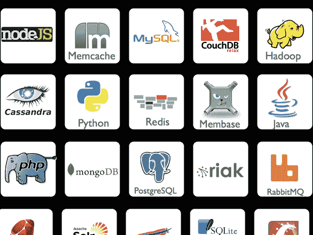

# YC 资助的 DotCloud:一个让你混搭的应用平台 TechCrunch

> 原文：<https://web.archive.org/web/https://techcrunch.com/2010/12/22/yc-funded-dotcloud-an-application-platform-that-lets-you-mix-and-match/>

# YC 资助的 DotCloud:一个让你混搭的应用平台

 在过去的几年里，托管应用平台的兴起让开发人员将注意力从服务器管理上移开，转而将全部精力放在编写和部署代码上。其中最著名的可能是 Heroku，它是一个 Rails 应用程序平台，刚刚被 Salesforce 以 2 . 12 亿美元收购。谷歌的应用引擎是 Python 和 Java 开发人员的另一个热门选择，并且有许多竞争者涌现出来。

[DotCloud](https://web.archive.org/web/20221208221128/http://www.dotcloud.com/) 是一家由 [Y Combinator](https://web.archive.org/web/20221208221128/http://www.ycombinator.com/) 资助的新公司，与这些公司类似，但有一个关键的不同:它不是专注于一两个流行的开发堆栈，而是希望通过让开发人员混合和匹配十几个预配置的组件来给他们更多的灵活性。

创始人 Solomon Hykes 解释说，像 Heroku 这样的大多数服务都限制你可以使用的语言和工具，随着时间的推移，这可能会成为问题。有时，公司决定在项目中途添加一门新语言，因为他们的开发人员恰好非常擅长这门语言。或者他们希望采用不同种类的数据库或框架来满足扩展需求。DotCloud 正着手为他们提供所需的灵活性，以便在中途做出这种改变。

该产品在过去的三个月里一直处于 alpha 测试阶段，在此期间已经有 20 家 Y Combinator 公司使用了该产品。Hykes 说，该团队根据这些 YC 大学同学和校友的要求调整了产品，这些公司的广泛采用似乎表明他们喜欢 DotCloud 的产品。

