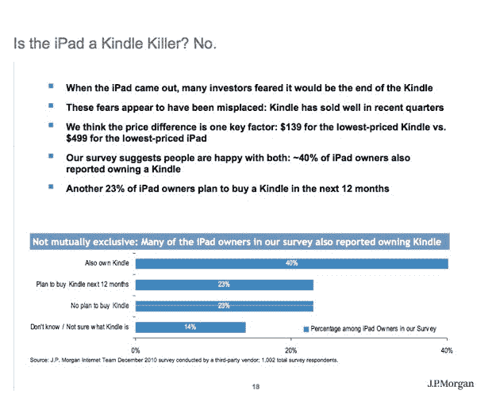
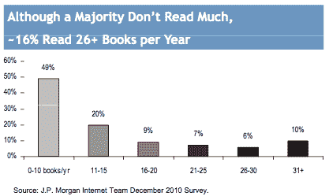
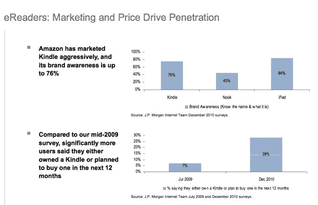

# 调查称:iPad 不是 Kindle 黑仔 TechCrunch

> 原文：<https://web.archive.org/web/http://techcrunch.com/2011/01/03/ipad-not-kindle-killer/?utm_source=twitterfeed&utm_medium=twitter&utm_campaign=Feed%3A+Techcrunch+(TechCrunch>&utm_content=Twitter)

# 调查显示:iPad 不是 Kindle 黑仔

虽然很多人预测 iPad 在第一次出现时会杀死 Kindle([包括我们](https://web.archive.org/web/20230202224933/https://techcrunch.com/2010/01/28/top-10-reasons-ipad-kindle/))，但事实证明这是错误的。非常不对。假期期间，Kindle 继续成为亚马逊历史上最畅销的产品，去年估计售出了 800 万台。

Kindle 是一款非常不同的设备。事实上，在 JP 摩根互联网团队最近对大约 1000 名消费者的调查中，40%的 iPad 用户也拥有 Kindle。对我来说，这听起来有点高，尽管它确实描述了我认识的所有拥有 iPad 的人。根据同一项调查，另有 23%的 iPad 用户计划在未来 12 个月内购买 Kindle。

Kindle 吸引了大量的读者。书虫是一个小众受众群体，但却是一个利润丰厚的群体。大约一半的被调查者每年阅读 0 到 10 本书。但是 16%的人每年阅读超过 25 本书。

这里的一大要点是，iPad 和 Kindle 被视为不同类型的产品，这是正确的。亚马逊在营销 Kindle 方面做得很好，它是专门为爱书人设计的电子书，价格最低的 Kindle 售价 139 美元，被视为与 499 美元的 iPad 不同的一类设备。(你可以把 iPad 当作 Kindle 阅读设备使用，这样消费者就不必做出非此即彼的决定，这也没什么坏处)。

亚马逊积极的 Kindle 广告也获得了回报。Kindle 拥有 76%的品牌认知度，几乎与 iPad 的 84%持平。这比它的直接竞争对手 Nook 要好得多，Nook 占有 45%的市场份额。28%的受访者表示，他们在未来 12 个月内拥有或计划购买 Kindle，相比之下，2009 年 7 月这一比例为 7%。

